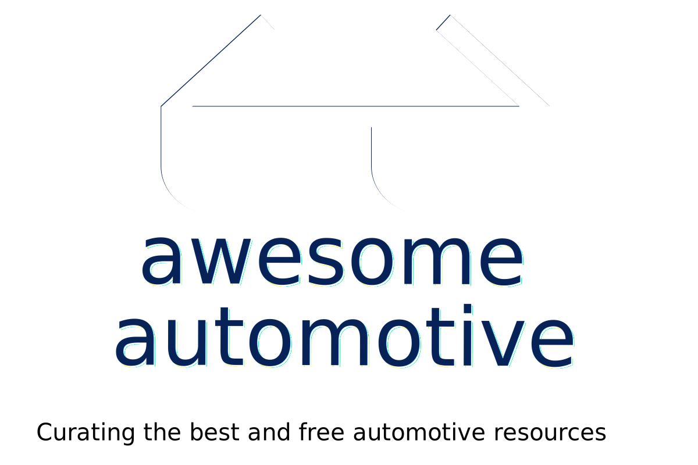

<!--lint disable awesome-heading-->

   
	
   

  

    

    
    We all know that automotive engineering is awesome, but here's a list of especially awesome things related to that world.  Let's help make this list really awesome:&emsp;&emsp;&emsp;&emsp; 
     ✅ perform review and leave a comment <strong><a href="https://github.com/Marcin214/awesome-automotive/issues/2">here</a></strong> 
     ✅ add new awesome record like <strong><a href="https://github.com/Marcin214/awesome-automotive/blob/master/contributing.md">here</a></strong>&emsp;&emsp;&nbsp;&emsp; &emsp;&emsp;&emsp;
     ✅ if sth needs to be improved, create an issue <strong><a href="https://github.com/Marcin214/awesome-automotive/issues">here</a></strong>&nbsp;&nbsp;
    
     
      
    
    
    
    
    
  

  

## Contents

- [OS](#os)
- [RTOS](#rtos)
  - [Autosar](#autosar)
  - [OSEK/VDX](#osekvdx)
  - [SafeRTOS](#safertos)
- [Automotive SPICE](#automotive-spice)
- [Autonomous Driving](#autonomous-driving)
- [Agile](#agile)
- [Bus Systems](#bus-systems)
  - [Automotive Ethernet](#automotive-ethernet)
  - [CAN](#can)
  - [FlexRay](#flexray)
  - [LIN](#lin)
  - [MOST](#most)
- [Functional Safety](#functional-safety)
- [Cyber Security](#cyber-security)
- [Hardware](#hardware)
- [Measurement and Calibration](#measurement-and-calibration)
- [Vehicle Diagnostics](#vehicle-diagnostics)
- [Architecture](#architecture)
- [Requirements engineering](#requirements-engineering)
  - [Polarion Software](#polarion-software)
  - [Rational DOORS](#rational-doors)
  - [SysML](#sysml)
- [Software Development](#software-development)
  - [Coding guidelines](#coding-guidelines)
  - [Debugging](#debugging)
- [Testing](#testing)
  - [Unit tests](#unit-tests)
  - [MC/DC](#mcdc)
  - [Static analysis](#static-analysis)
  - [Timing analysis](#timing-analysis)
  - [CANoe](#canoe)
- [Blogs](#blogs)
- [Books](#books)
- [Magazines](#magazines)
- [Podcasts](#podcasts)
- [Press releases](#press-releases)
- [Videos](#videos)
- [Miscellaneous](#miscellaneous)
- [Contribute](#contribute)

<!--lint disable awesome-list-item-->
## OS
- [Automotive Grade Linux](https://www.automotivelinux.org/) - Open source project to build Linux-based platforms for automotive applications.
- `2017` [Development Trend of Operating System Technology for Smart Car](https://www.ijrter.com/papers/volume-3/issue-1/development-trend-of-operating-system-technology.pdf) ![pdf]

## RTOS
### Autosar

- [AUTOSAR](https://www.autosar.org/) - (**AUT**omotive **O**pen **S**ystem **AR**chitecture) is a worldwide development partnership of vehicle manufacturers, suppliers, service providers and companies from the automotive electronics, semiconductor and software industry.
- [AUTOSAR Technical Overview](https://web.archive.org/web/20161201222022/http://www.autosar.org/about/technical-overview/) - Official AUTOSAR website, 2016.
- [About AUTomotive Open System ARchitecture](https://www.renesas.com/us/en/solutions/automotive/technology/autosar.html) - Renesas Electronics.
- [AUTOSAR Development Tools](https://www.renesas.com/us/en/solutions/automotive/manual-softtools.html) - Renesas Electronics, overview on toolset.
- [Artop](https://www.artop.org/) - The **A**UTOSA**R** **T**ool **P**latform is an implementation of development tools for AUTOSAR.
<!-- DEAD - [EB tresos®Studio documentation ](http://read.pudn.com/downloads263/doc/1209805/EB_tresos_Studio_documentation_en.pdf) ![pdf] -->
- [as](https://github.com/autoas/as) ![github] - Automotive software(OSEK & AUTOSAR) and its tool-chain.
- [autosar-framework](https://github.com/myGiter/autosar-framework) ![github] - Master-Thesis - Framework für wiederverwendbare Autosar Basis-Software-Module.
- [autosar](https://github.com/cogu/autosar) ![github] - A set of python modules for working with AUTOSAR XML files.
- [Arctic Core](https://github.com/Depthkernelcore/Arccore) ![github] - Open source AUTOSAR embedded platform.
- [Introduction to Autosar](https://elearning.vector.com/mod/page/view.php?id=437) - Vector Informatik, e-learning module.
- 

  
Suppliers of AUTOSAR standard software - Click to expand 
  

<table><thead><tr><th>Supplier</th><th>MCAL</th><th>BSW/OS/RTE</th><th>Tools</th></tr></thead><tbody><tr><td><a href="https://www.comasso.org/" target="_blank" rel="noopener noreferrer">COMASSO</a></td><td></td><td><a href="https://www.comasso.org/comasso_downloads" target="_blank" rel="noopener noreferrer">BSW</a></td><td><a href="https://www.comasso.org/comasso_downloads" target="_blank" rel="noopener noreferrer">BSWDT</a></td></tr><tr><td><a href="https://www.elektrobit.com/" target="_blank" rel="noopener noreferrer">Elektrobit</a></td><td></td><td><a href="https://www.elektrobit.com/products/ecu/eb-tresos/autocore/" target="_blank" rel="noopener noreferrer">EB tresos AutoCore</a>  </td><td><a href="https://www.elektrobit.com/products/ecu/eb-tresos/studio/" target="_blank" rel="noopener noreferrer">EB tresos Studio</a></td></tr><tr><td><a href="https://www.etas.com/" target="_blank" rel="noopener noreferrer">ETAS</a></td><td></td><td><a href="https://www.etas.com/en/products/rta_software_products.php" target="_blank" rel="noopener noreferrer">RTA</a></td><td><a href="https://www.etas.com/en/products/ascet-developer.php" target="_blank" rel="noopener noreferrer">ACET</a> <a href="https://www.etas.com/en/products/isolar.php" target="_blank" rel="noopener noreferrer">ISOLAR</a> <a href="https://www.etas.com/en/products/software_products.php" target="_blank" rel="noopener noreferrer">and more ...</a></td></tr><tr><td><a href="https://www.hitex.com/" target="_blank" rel="noopener noreferrer">Hitex</a></td><td><a href="https://www.hitex.com/tools-components/software-components/mcal-and-complex-drivers/mcal-drivers-for-autosar-projects/" target="_blank" rel="noopener noreferrer">MC-ISAR</a></td><td></td><td></td></tr><tr><td><a href="https://www.infineon.com/cms/en/" target="_blank" rel="noopener noreferrer">Infineon Technologies AG</a></td><td><a href="https://www.infineon.com/cms/en/product/microcontroller/32-bit-tricore-microcontroller/" target="_blank" rel="noopener noreferrer">MCAL</a></td><td></td><td></td></tr><tr><td><a href="https://www.kpit.com/" target="_blank" rel="noopener noreferrer">KPIT</a></td><td></td><td><a href="https://www.kpit.com/solutions/autosar/" target="_blank" rel="noopener noreferrer">K-SAR Suite</a></td><td><a href="https://www.kpit.com/workimpact/with-k-sar-editor-tool-engineers-configure-complete-ecus-intuitively-and-comfortably/" target="_blank" rel="noopener noreferrer">K-SAR Editor</a></td></tr><tr><td><a href="https://mentor.com/" target="_blank" rel="noopener noreferrer">Mentor</a></td><td></td><td><a href="https://www.mentor.com/embedded-software/autosar/software" target="_blank" rel="noopener noreferrer">VSTAR</a> </td><td><a href="https://www.mentor.com/embedded-software/autosar/tools" target="_blank" rel="noopener noreferrer">VSTAR Tools</a></td></tr><tr><td><a href="https://www.nxp.com/" target="_blank" rel="noopener noreferrer">NXP Semiconductors</a></td><td><a href="https://www.nxp.com/design/automotive-software-and-tools/autosar-:AUTOSAR-HOME#developer" target="_blank" rel="noopener noreferrer">MCAL</a></td><td><a href="https://www.nxp.com/design/automotive-software-and-tools/autosar-:AUTOSAR-HOME#developer" target="_blank" rel="noopener noreferrer">OS</a></td><td></td></tr><tr><td><a href="https://www.opensynergy.com/" target="_blank" rel="noopener noreferrer">OpenSynergy</a></td><td></td><td><a href="https://www.opensynergy.com/autosar/" target="_blank" rel="noopener noreferrer">COQOS</a></td><td><a href="https://www.opensynergy.com/autosar/" target="_blank" rel="noopener noreferrer">COQOSAReasy</a> </td></tr><tr><td><a href="https://www.renesas.com/us/en/" target="_blank" rel="noopener noreferrer">Renesas Electronics</a></td><td><a href="https://www.renesas.com/us/en/solutions/automotive/technology/autosar.html" target="_blank" rel="noopener noreferrer">MCAL</a></td><td></td><td></td></tr><tr><td><a href="https://www.st.com/content/st_com/en.html" target="_blank" rel="noopener noreferrer">STMicroelectronics</a></td><td><a href="https://www.st.com/en/embedded-software/spc5-autosar-mcal.html" target="_blank" rel="noopener noreferrer">MCAL</a></td><td></td><td></td></tr><tr><td><a href="https://www.vector.com/" target="_blank" rel="noopener noreferrer">Vector Informatik</a></td><td></td><td><a href="https://www.vector.com/pl/en/products/products-a-z/embedded-components/microsar/" target="_blank" rel="noopener noreferrer">MICROSAR</a></td><td><a href="https://www.vector.com/pl/en/products/products-a-z/software/davinci-developer/" target="_blank" rel="noopener noreferrer">DaVinci Developer</a> <a href="https://www.vector.com/pl/en/products/products-a-z/software/davinci-configurator-pro/" target="_blank" rel="noopener noreferrer">DaVinci Configurator</a> <a href="https://www.vector.com/pl/en/products/products-a-z/software/" target="_blank" rel="noopener noreferrer">and more ...</a> </td></tr></tbody></table>

- `2018` [Evaluation of Performance and Fault Containment in AUTOSAR Micro-ECUs on a Multi-Core Processor](https://networked-embedded.de/paper/urbina-mcsoc-2018.pdf) ![pdf]
- `2017` [Efficient Multi-core AUTOSAR-Platform Based on an Input/Output Gateway Core](https://networked-embedded.de/paper/urbina-pdp-2017.pdf) ![pdf]
- `2016` [Co-simulation framework for AUTOSAR multi-core processors with message-based Network-on-Chips](https://networked-embedded.de/paper/urbina-indin-2016.pdf) ![pdf]
- `2015` [Multi-core architecture for AUTOSAR based on virtual Electronic Control Units](https://networked-embedded.de/paper/urbina-etfa-2015.pdf) ![pdf]
- `2010` [Artop – An ecosystem approach for collaborative AUTOSAR tool development](https://hal.archives-ouvertes.fr/hal-02267845/document) ![pdf]
- `2010` [Interoperable AUTOSAR tooling with Artop](https://pdfs.semanticscholar.org/aef4/8c42d5252dbacb0aebd4491bb866289b8013.pdf?_ga=2.52826860.519889738.1591091523-1154219747.1586112696) ![pdf]
- `2010` [How the concepts of the Automotive standard "AUTOSAR" are realized in new seamless tool-chains](http://web1.see.asso.fr/erts2010/Site/0ANDGY78/Fichier/PAPIERS%20ERTS%202010/ERTS2010_0002_final.pdf) ![pdf]
- `2009` [AUTOSAR Runtime Environment and Virtual Function Bus](https://pdfs.semanticscholar.org/5f71/5e1b0192706de045b7d167b02441b90c2cbd.pdf?_ga=2.107492994.1632464626.1590175047-1154219747.1586112696) ![pdf]
- `2009` [AUTOSAR Software Architecture](https://pdfs.semanticscholar.org/b834/d611b20ba32f1cf7be3097f56449c4c350e4.pdf?_ga=2.64870191.1632464626.1590175047-1154219747.1586112696) ![pdf]
- `2009` [Methodology and Templates in AUTOSAR](https://pdfs.semanticscholar.org/235d/35baee4cdea3033492625d96bdc32a51813e.pdf?_ga=2.70596240.1632464626.1590175047-1154219747.1586112696) ![pdf]
- `2008` [How timing interfaces in AUTOSAR can improve distributed development of real-time software](https://pdfs.semanticscholar.org/1dfb/79ea35a11a96ee199ec3017cf14513fa8aaa.pdf?_ga=2.223182175.519889738.1591091523-1154219747.1586112696) ![pdf]
- `2008` [Enabling of AUTOSAR system design using Eclipse-based tooling](https://pdfs.semanticscholar.org/98ab/00c6e83cab79e9983785b211b15f5c350ded.pdf?_ga=2.224811742.519889738.1591091523-1154219747.1586112696) ![pdf]
- `2006` [Achievements and exploitation of the AUTOSAR development partnership](https://citeseerx.ist.psu.edu/viewdoc/download?doi=10.1.1.461.5164&rep=rep1&type=pdf) ![pdf]
- `2004` [AUTomotive Open System ARchitecture – An industry-wide initiative to manage the complexity of emerging Automotive E/E-Architectures](http://www.dii.unimo.it/~zanasi/didattica/Veicolo_OLD/AUTOSAR_Paper_Convergence_2004.pdf) ![pdf]

### OSEK/VDX
- [OSEK VDX Portal](https://web.archive.org/web/20160307021413/http://osek-vdx.org/) - down since 2017 due to the working group has been disbanded in favor of AUTOSAR.
- [OIL](http://trampolinebin.rts-software.org/oil25.pdf) ![pdf] - OSEK Implementation Language, specification version 2.5.
- [OS](http://trampolinebin.rts-software.org/os223.pdf) ![pdf] - Operating System, specification version 2.2.3.
- [COM](http://trampolinebin.rts-software.org/OSEKCOM303.pdf) ![pdf] - Communication, specification version 3.0.3.
- [ORTI A](http://trampolinebin.rts-software.org/orti-a-22.pdf) ![pdf] and [ORTI B](http://trampolinebin.rts-software.org/orti-b-22.pdf) ![pdf] - OSEK Run Time Interface (ORTI), specification version 2.2.
- [OS Test Plan](http://trampolinebin.rts-software.org/ostestplan20.pdf) - specification version 2.0.
- [OS Test Procedure](http://trampolinebin.rts-software.org/ostestproc20.pdf) ![pdf] - specification version 2.0.
- [COM Test Plan](http://trampolinebin.rts-software.org/comtestplan20.pdf) ![pdf] - specification version 2.0.
- [COM Test Procedure](http://trampolinebin.rts-software.org/comtestproc20.pdf) ![pdf] - specification version 2.0.
- [Chalandi Amine OSEK 2.2.3](https://github.com/Chalandi/OSEK) ![github] -  Implementation for ARM Cortex M3.
- [Elektrobit tresos](https://www.elektrobit.com/products/ecu/eb-tresos/osekcore/) - Commercial implementation of an OSEK RTOS
- [ERIKA Enterprise](http://www.erika-enterprise.com/) - Royalty free automotive OSEK/VDX certified Hard Real Time Operating System (RTOS)
- [ev3OSEK](https://github.com/ev3osek/ev3osek) ![github] - Implementation for the Mindstorms EV3 robots.
- [FreeOSEK](https://github.com/ciaa/firmware_v1) ![github] - Implementation (BSD license).
- [mKernel](https://sourceforge.net/projects/mkernel/) - Implementation (GPL license) with Partially OSEK/VDX compliant oil generator supporting only the Microchip PIC18F4550.
- [nxtOSEK](http://lejos-osek.sourceforge.net/) - Implementation for the Mindstorms NXT robots.
- [openOSEK](https://sourceforge.net/projects/openosek/) - Implementation (LGPL license).
- [PICOS18](https://web.archive.org/web/20120707172307/http://www.picos18.com:80/) - Implementation (GPL license) with support for Microchip PIC18.
- [Trampoline](https://github.com/TrampolineRTOS/trampoline) ![github] - Implementation (LGPL license).
- [Trioz OSEK RTOS](https://web.archive.org/web/20101128083753/http://www.trioztech.com/RTOS.htm) - Commercial implementation.

### SafeRTOS
- [freertos.org](https://www.freertos.org/FreeRTOS-Plus/Safety_Critical_Certified/SafeRTOS.html) - Main page. SafeRTOS is a functional safety, pre-certified RTOS.
- [FreeRTOS](http://www.aosabook.org/en/freertos.html) - overiview.
- `2011` [An Introduction to Software Development for Functional Safety on TI Processors](https://web.archive.org/web/20130704175730/http://www.ti.com/lit/wp/spry180/spry180.pdf) ![pdf]

## Automotive SPICE
- [ASPICE](http://www.automotivespice.com/download/) - Automotive SPICE® Process Assessment Model (PAM) and Process Reference Model (PRM).
- [Automotive SPICE: Ensuring ASPICE Compliance](https://www.youtube.com/playlist?list=PL5VAskozuQ3DwQIE3A8dGKWIRKPeNBTCG) ![video] - 321 Gang, Continuous Engineering Experts.
- `2011` [A Seamless Model-Based Development Process for Automotive Systems](https://citeseerx.ist.psu.edu/viewdoc/download?doi=10.1.1.600.1988&rep=rep1&type=pdf) ![pdf]

## Autonomous Driving
- [Awesome Autonomous Driving](https://github.com/autonomousdrivingkr/Awesome-Autonomous-Driving) ![awesome]
- [Awesome Autonomous Vehicles](https://github.com/manfreddiaz/awesome-autonomous-vehicles) ![awesome]
- [Awesome Self-Driving Cars](https://github.com/philbort/awesome-self-driving-cars) ![awesome]

## Agile
- [Scaled Agile Framework](https://www.scaledagileframework.com/) - (**SAFe**) set of organization and workflow patterns intended to guide enterprises in scaling lean and agile practices.
<!-- DEAD  - `2020` [VDA - Agile Collaboration v1.0 Online Document](https://vda-qmc.de/fileadmin/redakteur/Publikationen/Gelbdrucke/VDA_Yellow_Volume_Agile_Collaboration_EN_1_edition_2020.pdf) - Free Yellow Print for the Agile Collaboration. -->
- `2018` [Agile practices when developing safety systems](https://pdfs.semanticscholar.org/94ee/8799144ed97fa53aa3c9806e2db68d2cc22e.pdf?_ga=2.230015071.23004512.1592854073-1154219747.1586112696) ![pdf]
- `2017` [An Assessment of Avionics Software Development Practice: Justifications for an Agile Development](https://link.springer.com/content/pdf/10.1007%2F978-3-319-57633-6_14.pdf) ![pdf]
- `2014` [Scrum , documentation and the IEC 61508-3 : 2010 software standard](https://pdfs.semanticscholar.org/0819/fc97fac7e95e4f85d905be5f485fba2f5a54.pdf?_ga=2.37078499.23004512.1592854073-1154219747.1586112696) ![pdf]

## Bus Systems

### Automotive Ethernet
- [Introduction to Automotive Ethernet](https://elearning.vector.com/mod/page/view.php?id=149) - Vector Informatik, e-learning module.
- [Vector Automotive Ethernet Symposium 2019: Lectures](https://www.youtube.com/playlist?list=PLLKv-zcGiHJFaUFtXGcJX72EURLY8PWA9) ![video] - In 7 presentations - by Infineon, NXP, TÜV-Nord and Vector - the speakers showed the current status and solutions for the upcoming challenges, 2019
- [A TCP/IP Tutorial](https://tools.ietf.org/html/rfc1180) ![student]  - RFC 1180, short overview on ethernet.
- [OPEN Alliance. "Automotive Ethernet Specifications"](http://opensig.org/about/specifications/)
- [SOME/IP specification](http://some-ip.com/papers.shtml)
- [vsomeip in 10 minutes](https://github.com/GENIVI/vsomeip/wiki/vsomeip-in-10-minutes) - Introduction to SOME/IP based on GENIVI implementation.
- `2017` [Security Analysis of Ethernet in Cars](https://pdfs.semanticscholar.org/77df/1b9418a0bf67bb9155daa94ef162054dca23.pdf?_ga=2.132109839.1632464626.1590175047-1154219747.1586112696) ![pdf]
- 

  
Automotive Ethernet Stack - Click to expand 

<table><thead><tr><th>Use Case</th><th>Audio Video </th><th>Time  Sync</th><th>Network  Managment</th><th>Service  Control</th><th>Diagnostic </th><th>Address  Config</th><th>Helper Protocols</th></tr></thead><tbody><tr> <td align="center">Application</td> <td align="center"></td> <td align="center"></td> <td align="center"></td> <td align="center"></td><td align="center" rowspan="2"><a href="http://read.pudn.com/downloads191/doc/899044/ISO+14229+(2006).pdf">UDS*</a></td> <td align="center"></td> <td align="center"></td></tr><tr> <td align="center">Presentation</td> <td align="center"></td> <td align="center"></td> <td align="center"></td> <td align="center"></td> <td align="center"></td> <td align="center"></td></tr><tr> <td align="center">Session</td><td align="center" rowspan="2">IEEE 1722 (AVTP) </td><td align="center" rowspan="2">IEEE 802.1AS  (PTP) </td> <td align="center">UDP-NM</td> <td align="center"><a href="http://some-ip.com/papers.shtml">SOME/IP</a></td> <td align="center"><a href="http://read.pudn.com/downloads721/ebook/2887987/BS%20ISO%2013400-2-2012.pdf">DoIP*</a></td> <td align="center"><a href="https://tools.ietf.org/html/rfc2131">DHCP</a></td> <td align="center"></td></tr><tr> <td align="center">Transport</td><td align="center" colspan="4"><a href="https://tools.ietf.org/html/rfc793">TCP</a> and/or <a href="https://tools.ietf.org/html/rfc768">UDP</a></td> <td align="center"></td></tr><tr> <td align="center">Network </td> <td align="center"></td> <td align="center"></td><td align="center" colspan="4"><a href="https://tools.ietf.org/html/rfc791">IPv4</a>/<a href="https://tools.ietf.org/html/rfc2460">IPv6</a></td> <td align="center"><a href="https://tools.ietf.org/html/rfc792">ICMP</a>, <a href="https://tools.ietf.org/html/rfc4443">ICMPv6</a>, <a href="https://tools.ietf.org/html/rfc826">ARP</a>, <a href="https://tools.ietf.org/html/rfc4861">NDP</a> </td></tr><tr> <td align="center">Data Link</td><td align="center" colspan="7">Ethernet MAC + VLAN (802.1Q)</td></tr><tr> <td align="center">Physical</td><td align="center" colspan="7">Automotive Ethernet Physical  (Ethernet, <a href="http://opensig.org/about/specifications/">OPEN Alliance BroadR-Reach</a>, Reduced twisted-pair Gigabit Eth)</td></tr></tbody></table>(*) - superseded by newer version of standard

### CAN
- [CiA – CAN In Automation](https://www.can-cia.org/) ![warning]- A user organization for people interested in CAN.
- [Bosch specification](http://esd.cs.ucr.edu/webres/can20.pdf) ![pdf] - Specification superseded by the standard [ISO 11898](https://www.iso.org/standard/63648.html).
- [Bosch CAN FD specification Version 1.0](https://web.archive.org/web/20151211125301/http://www.bosch-semiconductors.de/media/ubk_semiconductors/pdf_1/canliteratur/can_fd_spec.pdf) ![pdf]
- [Controller Area Network (CAN) Schedulability Analysis: Refuted, Revisited and Revised](https://link.springer.com/article/10.1007%2Fs11241-007-9012-7)
- [Controller Area Network (CAN) Implementation Guide](https://www.analog.com/media/en/technical-documentation/application-notes/AN-1123.pdf) ![pdf]
- [Introduction to CAN](https://elearning.vector.com/mod/page/view.php?id=333) ![pdf] - Vector Informatik, e-learning module.
- [Controller Area Network](https://inst.cs.berkeley.edu/~ee249/fa08/Lectures/handout_canbus1.pdf) ![pdf] - UC Berkeley, presentation.
- [Understanding and Using the Controller Area Network](https://inst.cs.berkeley.edu/~ee249/fa08/Lectures/handout_canbus2.pdf) ![pdf] - UC Berkeley, CAN 2.0b.
- [CAN Protocol](https://www.kvaser.com/course/can-protocol-tutorial/) ![student] - Kvaser, tutorial.
- [CAN magazine](https://can-newsletter.org) - CiA publications.

### FlexRay
- [FlexRay Specification](https://svn.ipd.kit.edu/nlrp/public/FlexRay/FlexRay%E2%84%A2%20Protocol%20Specification%20Version%203.0.1.pdf) 
- [FlexRay Overview](https://www.ni.com/pl-pl/innovations/white-papers/06/flexray-automotive-communication-bus-overview.html) ![pdf] - National Instruments.
- [Introduction to FlexRay](https://elearning.vector.com/mod/page/view.php?id=371) - Vector Informatik, e-learning module.
- `2010` [The FlexRay Electrical Physical Layer Evolution](https://web.archive.org/web/20150216112537/http://www.hanser-automotive.de/fileadmin/heftarchiv/FLEX_10_ONL_NXP-Y.pdf) ![pdf] - Lorenz Steffen, magazine Automotive.

### LIN
- [Introduction to LIN](https://elearning.vector.com/mod/page/view.php?id=309) - Vector Informatik, e-learning module.
- [LIN Supplier ID Registration Authority](https://www.lin-cia.org/id/) - Standardized in the ISO 17987 series.
- [The LIN Short Story](https://www.nxp.com/files-static/training_pdf/29021_S08_SLIN_WBT.pdf) ![pdf] - NXP Semiconductors.

### MOST
- [MOST Cooperation Website](https://www.mostcooperation.com/) - Technology overview and specifications.

## Functional Safety
- [ISO 26262-1:2011 Road vehicles — Functional safety — Part 1: Vocabulary](https://www.iso.org/obp/ui/#iso:std:iso:26262:-1:ed-1:v1:en) - ISO Online Browsing Platform.
- [The 61508 Association](https://www.61508.org/index.php) - Group of companies with an interest in gaining the full benefits of the successful implementation of IEC 61508 and related standards.
- [IEC 61508-1:2010](https://github.com/wangdong412/Consen-SIS/tree/master/IEC61508) ![github] - Functional safety of electrical/electronic/programmable electronic safety-related systems.
- [SCSC - Publications](https://scsc.uk/publications) - Professional network for sharing knowledge about system safety.
- [exida](https://www.exida.com) - Worlds leading company for certification, safety, alarm management, cybersecurity.
- [Matrickz](https://www.matrickz.de/en/home.html) - Software development partner in the Automotive specialized in ASPICE, Security and Safety.
- [What is the ISO 26262 Functional Safety Standard ?](https://www.ni.com/pl-pl/innovations/white-papers/11/what-is-the-iso-26262-functional-safety-standard-.html#toc2) - National Instruments.
- [Criticality categories across safety standards in different domains](http://bricque.free.fr/docs/Publications/ERTS2012_Criticality_categories_across_safety_standards.pdf) ![pdf] - ERTS2 Congress.
- [A Case Study of Toyota Unintended Acceleration and Software Safety](https://www.exida.com/Webinars/Recordings) ![video] - Philip Koopman, and [slides](https://users.ece.cmu.edu/~koopman/pubs/koopman14_toyota_ua_slides.pdf) ![pdf]
- [Sudden unintended acceleration (SUA)](https://en.wikipedia.org/wiki/Sudden_unintended_acceleration#Sudden_acceleration_in_Toyota_vehicles) - Wikipedia, the US NHTSA estimates 16,000 accidents per year in USA.
- [Results of 2017 Embedded Systems Safety & Security Survey](https://www.youtube.com/watch?v=EMrgTOoRARE&feature=youtu.be&t=1) ![video] - Barr Group, list of all [webinars](https://www.youtube.com/playlist?list=PLjjaR7ZI1lwO6GqCAgWh003f834InzdUa) ![video]
- [Knowledge Bank of technical articles, presentations and talks](https://www.risktec.tuv.com/knowledge-bank/) - Risktec - TÜV Rheinland.
- `2017` [Talk on safety-critical systems and criticisms of the standards](https://www.youtube.com/watch?v=E0igfLcilSk) ![video] - Professor Martyn Thomas CBE.
- `2017` [Talk on correctness by construction techniques](https://www.youtube.com/watch?v=03mUs5NlT6U&feature=youtu.be&t=1) ![video] - Professor Martyn Thomas CBE.
- `2014` [Tools and Methods for Validation and Verification as requested by ISO26262](https://citeseerx.ist.psu.edu/viewdoc/download?doi=10.1.1.397.1932&rep=rep1&type=pdf) ![pdf]
- `2013` [A Reference Example on the Specification of Safety Requirements using ISO 26262](https://citeseerx.ist.psu.edu/viewdoc/download?doi=10.1.1.372.2716&rep=rep1&type=pdf) ![pdf]
- `2012` [Early Safety Evaluation of Design Decisions in E/E Architecture according to ISO 26262](https://citeseerx.ist.psu.edu/viewdoc/download?doi=10.1.1.666.8479&rep=rep1&type=pdf) ![pdf]
- `2004` [NASA Software Safety Guidebook](https://standards.nasa.gov/standard/nasa/nasa-gb-871913)
- `2002` [Safety Critical Systems: Challenges and Directions](http://users.encs.concordia.ca/~ymzhang/courses/reliability/ICSE02Knight.pdf) ![pdf]

## Cyber Security
- [Automotive Cybersecurity Overview](https://www.nhtsa.gov/crash-avoidance/automotive-cybersecurity) - From NHTSA (United States Department of Transportation), set of articles.
- [Cyber Security - SIG](https://site.ieee.org/ocs-cssig/?page_id=736) - From IEEE.org, numbers of great resources. 
- [Vehicle Control Unit Security using Open Source AUTOSAR](http://publications.lib.chalmers.se/records/fulltext/219822/219822.pdf) ![pdf] - Masters Thesis in Software Engineering.
- `2019` [Vector Cybersecurity Symposium 2019: Lectures](https://www.youtube.com/playlist?list=PLLKv-zcGiHJHxvK3v0sRYO9Kpnpb-Thz9) ![video] - Vector Informatik.
- `2017` [Vector Cybersecurity Symposium 2017: Lectures](https://www.youtube.com/playlist?list=PLLKv-zcGiHJGvyWfoPaTMw0QN3306wTPm) ![video] - Vector Informatik.
- `2016` [Vector Cybersecurity Symposium 2016: Lectures](https://www.youtube.com/playlist?list=PLLKv-zcGiHJHdtX4Vmw8n8DBFuDlmQCQy) ![video] - Vector Informatik.
- `2010` [Cryptography Engineering: Design Principles and Practical Applications](https://gateway.pinata.cloud/ipfs/QmNjLoag9KseUKqqCqJhdcDSDuB1zmRZJSJDy5UimpWfEk) ![pdf]![book] - Niels Ferguson, Bruce Schneier, Tadayoshi Kohno.
- `2008` [Security Engineering: A Guide to Building Dependable Distributed Systems](https://img1.wsimg.com/blobby/go/ee806800-06e9-4f1e-bd18-64422d491bcb/downloads/1cfn0trka_845432.pdf) ![pdf]![book] - Ross J. Anderson.
- [Awesome Vehicle Security](https://github.com/jaredthecoder/awesome-vehicle-security) ![awesome] - Books, hardware, software, applications, car hacking and more. 

## Hardware
- [AEC Component Technical Committee](http://www.aecouncil.com/) - Standardization body for high quality electronic components standards, documents can be downloaded directly.

## Measurement and Calibration
- [ASAM MCD-1 XCP](https://www.asam.net/standards/detail/mcd-1-xcp/wiki/) - ASAM (Association for Standardisation of Automation and Measuring Systems) standard.
- `2017` [XCP fundamentals: measuring, calibrating and bypassing based on the ASAM standard](https://www.youtube.com/watch?v=Fo3S3vKn1dk) ![video] - Vector Informatik.
- `2016` [XCP – The Standard Protocol for ECU Development](https://assets.vector.com/cms/content/application-areas/ecu-calibration/xcp/XCP_ReferenceBook_V3.0_EN.pdf) ![book]![pdf]

## Vehicle Diagnostics
<!-- DEAD 
- [ISO 14229-1:2006](http://read.pudn.com/downloads191/doc/899044/ISO+14229+(2006).pdf) ![pdf] - Unified Diagnostic Services (UDS) specification, superseded by the standard [ISO 14229-1:2013](https://www.iso.org/standard/55283.html).
- [ISO 13400-2:2012](http://read.pudn.com/downloads721/ebook/2887987/BS%20ISO%2013400-2-2012.pdf) ![pdf] - Road vehicles - Diagnostic communication over Internet Protoco (DoIP).-->
- [Information Posters](https://automotive.softing.com/en/service/order-of-information-poster.html) - Softing Automotive, about UDS, ODX, OTX, DoIP.
- [Diagnostics and Flashing](https://www.youtube.com/playlist?list=PLLKv-zcGiHJFZ0ueLgYRZfSa6l-eTcwBh) ![video] - Official Vector Informatik YouTube channel, more [here](https://vctr.it/2B8hbJh).
- `2013` [Unified Diagnostic Services Protocol Implementation in an Engine Control Unit](https://pdfs.semanticscholar.org/f58e/dbc2c2faf010f03f7fc64798996adc160727.pdf?_ga=2.26818169.519889738.1591091523-1154219747.1586112696) ![pdf]
- `2011` [Remote Vehicle Diagnostics over the Internet using the DoIP Protocol](https://citeseerx.ist.psu.edu/viewdoc/download?doi=10.1.1.418.5332&rep=rep1&type=pdf) ![pdf]
- `2008` [Usage of AUTOSAR diagnostic modules in a MOST electronic control unit](https://pdfs.semanticscholar.org/85e2/1a2e7778443f7b113b58b9f9ada812959757.pdf?_ga=2.266760778.519889738.1591091523-1154219747.1586112696) ![pdf]

## Architecture

- [Enterprise Architect](https://sparxsystems.com/products/ea/) - Sparx Systems - tool vendor, contains demo, tutorials and more.
- [Gaphor](https://gaphor.org) - Open source modeling tool supporting UML and SysML.
- `2018` [Clean Architecture: A Craftsman's Guide to Software Structure and Design](http://prof.mau.ac.ir/images/Uploaded_files/Clean%20Architecture_%20A%20Craftsman%E2%80%99s%20Guide%20to%20Software%20Structure%20and%20Design-Pearson%20Education%20(2018)[7615523].PDF) ![pdf]![book] - Robert C. Martin.
- `2016` [A Gateway Core between On-chip and Off-chip Networks for an AUTOSAR Message-based Multi-core](https://networked-embedded.de/paper/urbina-ame-2016.pdf) ![pdf]
- `2011` [ISO/IEC/IEEE42010](https://nanopdf.com/download/iso-iec-ieee-420102011e-systems-and-software-engineering_pdf) ![pdf] - Systems and software engineering - Architecture description.
- `2008` [Automotive real time development using a timing-augmented AUTOSAR specification](https://pdfs.semanticscholar.org/ca8c/6d82300061c0ad31d7717fc00e0875cbd96e.pdf?_ga=2.190666095.519889738.1591091523-1154219747.1586112696) ![pdf]
- `1998` [IEEE Std 1016](http://ccftp.scu.edu.cn:8090/Download/b4994628-e3e2-450f-882b-488939cecf30.pdf) ![pdf] - IEEE Recommended Practice for Software Design Descriptions.
- [Awesome Software Architecture](https://github.com/simskij/awesome-software-architecture) ![awesome]

## Requirements engineering

- `2011` [Systems Engineering Principles and Practice](https://industrialeblog.files.wordpress.com/2016/07/systems-engineering-principles-and-practice-2nd-edition.pdf) ![pdf]![book] - Alexander Kossiakof, William N. Sweet, Samuel J. Seymour, Steven M. Biemer.
- `2007` [Systems Engineering Handbook](https://www.nasa.gov/sites/default/files/atoms/files/nasa_systems_engineering_handbook.pdf) ![pdf]![book] - NASA/SP-2007-6105 Rev1.
- `2005` [Requirements Engineering](https://staff.agu.edu.vn/hphai/wp-content/uploads/2015/08/Springer-Requirements-Engineering-2nd-Edition-Plantilla-req-pag-85.pdf) ![pdf]![book] - Elizabeth Hull, Ken Jackson and Jeremy Dick.
- `2002` [Requirements Engineering in Automotive Development: Experiences and Challenges](https://citeseerx.ist.psu.edu/viewdoc/download?doi=10.1.1.490.1707&rep=rep1&type=pdf) ![pdf]
- `1998` [IEEE Std 1233](https://pdfs.semanticscholar.org/4018/ea1263f10052e3197c4d2a866b62fde83167.pdf) ![pdf]- IEEE Guide for Developing System Requirements Specifications.

### Polarion Software

- [Polarion Tutorial Videoss](https://polarion.plm.automation.siemens.com/tutorials) ![video]![student] - From tool vendor - Siemens Industry Software.
- [Vector Polarion Connection Utility](https://www.youtube.com/watch?v=_nX4FiX92_A) ![video] - Add-on tool for Vector vTESTstudio that serves to integrate Siemens Polarion ALM into the Vector testing tool chain.

### Rational DOORS

- [Getting started](https://www.ibm.com/developerworks/rational/library/getting-started-ibm-rational-doors/index.html) ![student] - Tutorial for IBM Rational DOORS and IBM Rational DOORS Web Access.
- [Documentation](https://www.ibm.com/support/pages/node/594725) - Library pages contain documentation for earlier versions of Rational products.
- [Essentials](https://www.youtube.com/playlist?list=PLFB5C518530CFEC93) ![video] - Hands-on examples.
- [IBM Rational Rhapsody tips and tricks](https://www.youtube.com/playlist?list=PLaBR7gZA1IOjxthOjpG3aAKeyRt04Wlhd) ![video] - Hands-on examples.
- [Using DXL](https://www.ibm.com/support/knowledgecenter/SSYQBZ_9.5.0/com.ibm.doors.configuring.doc/topics/c_dxl.html) - The Rational DOORS eXtension Language (DXL), scripting language, used to control DOORS.
- [The DXL Reference Manual](https://www.ibm.com/support/knowledgecenter/SSYQBZ_9.5.0/com.ibm.doors.requirements.doc/topics/dxl_reference_manual.pdf?view=kc)

### SysML

- [Architecture modelling](https://github.com/spacekitteh/zephyrgc/tree/master/Architecture%20modelling) ![github] - Set of SysML related books, available in pdf.
- `2011` [SysML for embedded automotive Systems: lessons lear ned](https://pdfs.semanticscholar.org/8b50/8115cf085b6ec71c32bba83c553801ac8985.pdf?_ga=2.228990748.1632464626.1590175047-1154219747.1586112696) ![pdf]
- `2010` [SysML for embedded automotive Systems : a practical approach](https://pdfs.semanticscholar.org/732a/11ca70fb34e05e47276500594c48f83e93d7.pdf?_ga=2.233208222.1632464626.1590175047-1154219747.1586112696) ![pdf]
- `2010` [Model synchronization at work: keeping SysML and AUTOSAR models consistent](https://citeseerx.ist.psu.edu/viewdoc/download?doi=10.1.1.455.7330&rep=rep1&type=pdf) ![pdf]

## Software Development

- [Modern Embedded Systems Programming](https://www.youtube.com/playlist?list=PLPW8O6W-1chwyTzI3BHwBLbGQoPFxPAPM) ![video]![student] - Hands-on lessons about embedded microcontrollers in C.
- `2019` [Safe Software for Autonomous Mobility With Modern C++](https://www.youtube.com/watch?v=5WbdLUc9Jls) ![video] - Andreas Pasternak, CppCon.
- `2019` [Writing Safety Critical Automotive C++ Software for High Performance AI Hardware](https://www.youtube.com/watch?v=F4GzsA00s5I) ![video] - Michael Wong, CppCon.
- `2017` [Driving Into the Future With Modern C++: A Look at Adaptive Autosar](https://www.youtube.com/watch?v=YzyGgZ_RClw&feature=emb_title) ![video] - Jan Babst, CppCon.
- `2011` [The Clean Coder: A Code of Conduct for Professional Programmers](https://github.com/mofrubel/books-1/blob/master/software-development/clean-coder-conduct-professional-programmers.pdf) ![book]![github] - Robert C. Martin.
- `2008` [Clean Code: A Handbook of Agile Software Craftsmanship](https://enos.itcollege.ee/~jpoial/oop/naited/Clean%20Code.pdf) ![book]![pdf] - Robert C. Martin.
- `2007` [Software engineering for automotive systems: A roadmap](https://citeseerx.ist.psu.edu/viewdoc/download?doi=10.1.1.125.6142&rep=rep1&type=pdf) ![pdf]
- `1998` [IEEE Std 830](http://www.math.uaa.alaska.edu/~afkjm/cs401/IEEE830.pdf) ![pdf] - IEEE Recommended Practice for Software Requirements Specifications.
- `1998` [IEEE Std 730](http://mazure.fr/attic/IEEE7301989.pdf) ![pdf] - IEEE Standard for Software Quality Assurance Plans.
- [Awesome C](https://github.com/aleksandar-todorovic/awesome-c) ![awesome]
- [Awesome C++](https://github.com/fffaraz/awesome-cpp#readme) ![awesome]
- [Awesome Embedded](https://github.com/nhivp/Awesome-Embedded) ![awesome]
- [Awesome MATLAB](https://github.com/mikecroucher/awesome-MATLAB) ![awesome]

### Coding guidelines

- [Guidelines for the use of the C++14 language in critical and safety-related systems](https://www.autosar.org/fileadmin/user_upload/standards/adaptive/17-03/AUTOSAR_RS_CPP14Guidelines.pdf) ![pdf] - AUTOSAR standard.
- [MISRA](https://www.misra.org.uk/Publications/tabid/57/Default.aspx) - Motor Industry Software Reliability Association, publications.
- [SEI CERT Coding Standards](https://wiki.sei.cmu.edu/confluence/display/c/SEI+CERT+C+Coding+Standard) - Languages such as C, C++, Java, and Perl, and the Android™ platform.
- `2008` [MISRA-C:2004 : guidelines for the use of the C language in critical systems](http://caxapa.ru/thumbs/468328/misra-c-2004.pdf) ![book]![pdf]
- `2008` [Guidelines for the use of the C++ language in critical systems : MISRA C++ 2008](http://www.tlemp.com/download/rule/MISRA-CPP-2008-STANDARD.pdf) ![pdf] 
### Debugging

- [MULTI Integrated Development Environment](https://www.ghs.com/products/MULTI_IDE.html)
- [Trace32 Lauterbach GmbH](https://www.lauterbach.com/frames.html?home.html) - High-tech company for microprocessor development tools. 
- [Trace32 basic examples of usage](https://www.youtube.com/playlist?list=PLlgTI9rjcm35NUgKufepfqgn6Fd4zBe88) ![video] - Lauterbach GmbH. 
- [Trace32: Debug your embedded systems](https://www.youtube.com/playlist?list=PL1sbHjUq1DdqQSBlk-uM-EJ3O1iof0-IN) ![video] - Nohau Solutions.
- [iSYSTEM AG](https://www.isystem.com/products/id-3rd-party-software-support/autosar.html) - Debugging tools supplier WinIDEA, iC5000 Base Unit, testIDEA.

## Testing

- [Vector Testing Symposium 2017: Lectures](https://www.youtube.com/playlist?list=PLLKv-zcGiHJEpfR5iAZBNjpl1NIpRA7Gw) ![video] - Official Vector Informatik YouTube channel.
- [Vector Testing Symposium 2018: Lectures](https://www.youtube.com/playlist?list=PLLKv-zcGiHJFxt_WSazEXShViv_jnlu0K) ![video] - Official Vector Informatik YouTube channel.
- `2018` [Software Testing Symposium 2018: Lectures](https://www.youtube.com/playlist?list=PLLKv-zcGiHJHCmgtUcp5YOfmNkEgiXERd) ![video] - Vector Informatik.
- `2015` [Simulation Environment based on SystemC and VEOS for Multi-Core Processors with Virtual AUTOSAR](https://networked-embedded.de/paper/urbina-cit-2015.pdf) ![pdf]
- [Awesome Software Quality](https://github.com/ligurio/awesome-software-quality#readme) ![awesome]

### Unit tests

- [ARUnit](https://www.artop.org/arunit/) - Unit Testing of AUTOSAR Software Components.
- [Google Test](https://github.com/google/googletest) ![github] - Google's C++ test framework.
- [Googletest Mocking (gMock) Framework](https://github.com/google/googletest/tree/master/googlemock) ![github] - Google's framework for writing and using C++ mock classes.
- [Fake Function Framework (fff)](https://github.com/meekrosoft/fff) ![github] - Micro-framework for creating fake C functions for tests. 
- [Unit Testing C Code](https://stackoverflow.com/questions/65820/unit-testing-c-code?page=1&tab=votes#tab-top) ![stackoverflow] - Discussion with overview on available C unit test frameworks.

### MC/DC

- [A Practical Tutorial on Modified Condition/Decision Coverage](https://shemesh.larc.nasa.gov/fm/papers/Hayhurst-2001-tm210876-MCDC.pdf) ![pdf]
- [The Effect of Program and Model Structure on MC⁄DC Test Adequacy Coverage](http://se.inf.ethz.ch/old/teaching/2009-S/0276/slides/fiva.pdf) ![pdf]

### Static analysis

- [Astrée](https://www.absint.com/astree/index.htm) -  Code RuleChecker for compliance with MISRA, CWE, ISO/IEC, AUTOSAR, and SEI CERT C coding rules. Usage of Astrée can be qualified according to DO-178B/C, ISO 26262, IEC 61508, EN-50128, the FDA Principles of Software Validation, and other safety standards.
- [Helix QAC](https://www.perforce.com/products/helix-qac) - Code analyzer verifying compliance with coding standards such as MISRA and AUTOSAR. Certified for functional safety compliance.
- [LDRA](https://ldra.com/aerospace-defence/capabilities/code-quality-review/) - Sets of Code Quality Review Tools.
- [NaiveSystems Analyze](https://github.com/naivesystems/analyze) - A static analysis tool for code security and compliance. Its community edition is open-source which supports MISRA C:2012, MISRA C++:2008 and AUTOSAR C++14.
- [Awesome Static Analysis](https://github.com/analysis-tools-dev/static-analysis) ![awesome]

### Timing analysis

- [GLIWA](https://www.gliwa.com/) - Worldwide leading provider for timing analysis, optimization and verification, [resources](https://www.gliwa.com/index.php?page=papers&lang=eng).
- [TA Tool Suite - Managing the Timing Behavior of AUTOSAR Multi-Core ECUs](https://www.vector.com/int/en/products/products-a-z/software/ta-tool-suite/) - Vector Informatik.
- `2020` [Runtime Analysis of AUTOSAR Embedded Projects](https://www.youtube.com/watch?v=C2NFKwUOpMk&list=PLLUr1-D7UabianTZOBIPKH1sA4M4nKhTw&index=2&t=5767s) ![video] - Florian Sommer, Sebastian Ziegler.
- `2012` [Tool support for seamless system development based on AUTOSAR timing extensions](https://pdfs.semanticscholar.org/04c8/ba5319986e246f96df2be8307eb09bd1690f.pdf?_ga=2.65429098.519889738.1591091523-1154219747.1586112696) ![pdf]
- `2007` [Timing Simulation of Interconnected AUTOSAR Software-Components](https://citeseerx.ist.psu.edu/viewdoc/download?doi=10.1.1.659.7962&rep=rep1&type=pdf) ![pdf]

### CANoe

- [CANoe: Product Videos](https://www.youtube.com/playlist?list=PL9EA087B9E8301D23) ![video] - Official Vector Informatik YouTube channel.
- [Programming with CAPL](https://can-newsletter.org/assets/files/media/raw/a456e3078f907a0482182ce831912427.pdf) ![pdf]
- [Tips and Tricks for the Use of CAPL](https://kb.vector.com/entry/875/) - Three consecutive articles, for all levels of user knowledge [Part One](https://kb.vector.com/upload_551/file/CAPL_1_CANNewsletter_201406_PressArticle_EN.pdf), [Part Two](https://kb.vector.com/upload_551/file/CAPL_2_CANNewsletter_201409_PressArticle_EN.pdf), [Part Three](https://kb.vector.com/upload_551/file/CAPL_3_CANNewsletter_201411_PressArticle_EN.pdf).

## Blogs
- [just auto](https://www.just-auto.com/) - Global automotive industry news, data and analysis. Recent information about OEMs and suppliers.
- [automotivetechis](https://automotivetechis.wordpress.com/) -  From engineer with 10 years in automotive domain.
- [automotive wiki](https://automotive.wiki/index.php/Main_Page) - From [SCHEID automotive GmbH](https://www.scheid-automotive.com/).
- [AUTOSAR tutorials](https://autosartutorials.com)
- [Small Business Programming](https://smallbusinessprogramming.com/) - A set of great articles on every programmers topic.

## Books
- `2018` [Technical Papers on the Development of Embedded Electronics](https://assets.vector.com/cms/content/know-how/_technical-articles/Pressbook_EN_2018.pdf) ![warning]![book]![pdf] - Vector Informatik GmbH.
- `2016` [The Car Hacker's Handbook - A Guide for the Penetration Tester](https://docs.alexomar.com/biblioteca/thecarhackershandbook.pdf) ![book]![pdf] - Craig Smith.
- `2012` [Understanding Automotive Electronics Eighth Edition](https://www.etf.ues.rs.ba/~slubura/Mehatronicki%20sistemi%20kod%20motora%20i%20vozila/Literatura/understanding%20automative%20electronics.pdf) ![book]![pdf] - William B. Ribbens.
- `2011` [FMEA Handbook](https://fsp.portal.covisint.com/documents/106025/14555722/FMEA%20Handbook%20v4.2/4c14da5c-0842-4e60-a88b-75c18e143cf7) ![book]![pdf] - Ford.
- `2009` [Automotive Embedded Systems Handbook](https://d1.amobbs.com/bbs_upload782111/files_38/ourdev_629261ASTZIF.pdf) ![book]![pdf] - Nicolas Navet.
- `2003` [Automotive software engineering : principles, processes, methods, and tools](http://docshare02.docshare.tips/files/27605/276056254.pdf) ![book]![pdf] - Jörg Schäuffele, Thomas Zurawka.
- [engineeringbookspdf](https://www.engineeringbookspdf.com/automobile-engineering/) ![search] - Free access to about 150 automotive books.
- [engbookspdf](https://www.engbookspdf.com/Automobile/) ![search] - Free access to about 35 automotive books.
- [engbookspdf](http://www.engineering108.com/pages/Automobile_Engineering/Automobile-engineering-ebooks-free-download.html) ![search] - Free access to about 5 automotive books.
- [eBooks-IT.org](https://ebooks-it.org/) ![search] - Online library for IT ebooks.
- [Free Programming Books](https://github.com/sindresorhus/awesome) ![awesome]

## Magazines

- [SAE Magazines](https://www.sae.org/publications/magazines) ![warning] - A set of free magazines from automotive industry.
- [Vehicle Electronics](https://vehicle-electronics.biz/) - Free monthly magazine for automotive electronics engineers.
- [CAN magazine](https://can-newsletter.org/magazine) - CiA publications.

## Podcasts

- [SAE Tomorrow Today](https://www.sae.org/podcasts) ![podcast] - SAE International, provides perspectives from innovative industry leaders.
- [Matrickz TechTalk](https://www.matrickz.de/en/podcasts.html) ![podcast] - Matrickz, about ASPICE, Security and Safety (ISO26262).
- [Embedded.fm](https://embedded.fm/) ![podcast] - A site dedicated to the many aspects of engineering.
- [InsideEVs](https://www.spreaker.com/show/insideevs-podcast) ![podcast] - Electric Vehicle News.
- [EV News Daily](https://www.evnewsdaily.com/) ![podcast] - A daily podcast about electric cars, hybrids and sustainable transport news.

## Press releases

- [Continental AG](https://www.continental.com/en/press/press-releases)
- [Elektrobit (EB)](https://www.elektrobit.com/tech-corner/)
- [Renesas Electronics Corporation](https://www.renesas.com/us/en/solutions/automotive.html)
- [OPEN Alliance](http://opensig.org/news/press-releases/)
- [SAE International](https://www.sae.org/news/press-room)
- [Softing Automotive Electronics GmbH](https://automotive.softing.com/en/service/press-publications/press-releases.html)
- [Vector Informatik GmbH](https://www.vector.com/int/en/)

## Videos

- [Automotive Logistics](https://www.youtube.com/user/autologisticschannel) ![video]
- [Embedded Meetup Egypt](https://www.youtube.com/channel/UC4iQ7Bz-3MKeMsfs3Bb4QjQ/featured) ![video] - Webinars related to software development for automotive embedded systems.
- [Official Elektrobit](https://www.youtube.com/user/EBAutomotiveSoftware/featured) ![video]
- [MATLAB](https://www.mathworks.com/videos.html) ![video] - Videos and Webinars.
- [Vector Informatik](https://www.youtube.com/channel/UC7P-ggVSMhM28LmVzwf2BQw) ![video] - YouTube channel.
- [Automotive World](https://vimeo.com/automotiveworld) ![video] - Company, educating automotive and vehicle industry stakeholders since 1992.

## Miscellaneous

- [Universität Siegen](https://networked-embedded.de/es/index.php/PublicationList.html) - Publication list about critical safety and AUTOSAR projects.
- [Vector Support & Downloads](https://www.vector.com/int/en/search/?tx_solr%5Bfilter%5D%5B0%5D=contentType%3Atx_solr_file&tx_solr%5Bsort%5D=datetime+desc&tx_solr%5BresultsPerPage%5D=10) - Over 1000 great materials: webinars, articles and more.
- [Vector Knowledge Base](https://kb.vector.com/) - Vector platform with examples and solutions for problems related to offered products.
- `2018` [TOP 100 OEM suppliers](https://www.autonews.com/assets/pdf/ca116090622.pdf) ![pdf] - Suplement to Automotive News magazine.
- `2013` [TOP 100 OEM suppliers](https://www.autonews.com/assets/PDF/CA89220617.PDF) ![pdf] - Suplement to Automotive News magazine.
- [Awesome Indexed](https://awesome-indexed.mathew-davies.co.uk/) ![awesome]![search] - Search the Awesome dataset.
- [Awesome Search](https://awesomelists.top/) ![awesome]![search]  - Quick search for Awesome lists.
<!--lint enable awesome-list-item-->

## Contribute

Contributions welcome! Read the [contribution guidelines](contributing.md) first.

[video]: media/icons/video.png 'video'
[awesome]: media/icons/awesome.png 'awesome'
<!-- [blog]: media/icons/blog.png 'blog' -->
[book]: media/icons/book.png 'book'
[github]: media/icons/github.png 'github'
[pdf]: media/icons/pdf.png 'pdf'
[podcast]: media/icons/podcast.png 'podcast'
[search]: media/icons/search.png 'search'
[stackoverflow]: media/icons/stackoverflow.png 'stackoverflow'
[student]: media/icons/student.png 'student'
[warning]: media/icons/warning.png 'warning'
