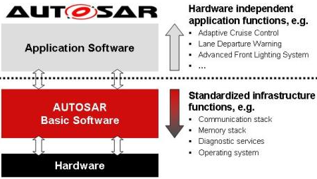
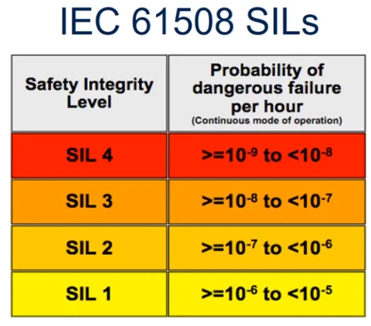

<!--lint disable no-unused-definitions-->
[comment]:
<!--lint enable no-unused-definitions-->

   
	
   

  

    

    
    We all know that automotive engineering is awesome, but here's a list of especially awesome things related to that world.  Let's help make this list really awesome:&emsp;&emsp;&emsp;&emsp; 
     ✅ perform review and leave a comment <strong><a href="https://github.com/Marcin214/awesome-automotive/issues/2">here</a></strong> 
     ✅ add new awesome record like <strong><a href="https://github.com/Marcin214/awesome-automotive/blob/master/contributing.md">here</a></strong>&emsp;&emsp;&nbsp;&emsp; &emsp;&emsp;&emsp;
     ✅ if sth needs to be improved, create an issue <strong><a href="https://github.com/Marcin214/awesome-automotive/issues">here</a></strong>&nbsp;&nbsp;
    
     
      
    
    
    
    
    
  

  

<!--lint disable list-item-bullet-indent-->
## Contents

- [Autosar](#autosar)
- [Automotive SPICE](#automotive-spice)
- [Autonomous Driving](#autonomous-driving)
- [Agile](#agile)
- [Bus Systems](#bus-systems)
  - [Automotive Ethernet](#automotive-ethernet)
  - [CAN](#can)
  - [FlexRay](#flexray)
  - [LIN](#lin)
  - [MOST](#most)
- [Functional Safety](#functional-safety)
- [Cyber Security](#cyber-security)
- [Measurement and Calibration](#measurement-and-calibration)
- [Vehicle Diagnostics](#vehicle-diagnostics)
- [Software Development Process](#software-development-process)
  - [Requirements](#requirements)
  - [Design](#design)
  - [Implementation](#implementation)
  - [Software Test](#software-test)
  - [Functional Test](#functional-test)
- [Blogs](#blogs)
- [Books](#books)
- [Magazines](#magazines)
- [Podcasts](#podcasts)
- [Press releases](#press-releases)
- [Videos](#videos)
- [Miscellaneous](#miscellaneous)
<!--lint enable list-item-bullet-indent-->
<!--lint disable awesome-list-item-->
## Autosar

- [AUTOSAR](https://www.autosar.org/) - (**AUT**omotive **O**pen **S**ystem **AR**chitecture) is a worldwide development partnership of vehicle manufacturers, suppliers, service providers and companies from the automotive electronics, semiconductor and software industry.

Overview

- [AUTOSAR Technical Overview](https://web.archive.org/web/20161201222022/http://www.autosar.org/about/technical-overview/) - Official AUTOSAR website, 2016.
- [About AUTomotive Open System ARchitecture](https://www.renesas.com/us/en/solutions/automotive/technology/autosar.html) - Renesas Electronics.
- [Introduction to Autosar](https://elearning.vector.com/mod/page/view.php?id=437) - Vector Informatik, e-learning module.
- 

  
Suppliers of AUTOSAR standard software - Click to expand 
  

<table><thead><tr><th>Supplier</th><th>MCAL</th><th>BSW/OS/RTE</th><th>Tools</th></tr></thead><tbody><tr><td><a href="https://www.comasso.org/" target="_blank" rel="noopener noreferrer">COMASSO</a></td><td></td><td><a href="https://www.comasso.org/comasso_downloads" target="_blank" rel="noopener noreferrer">BSW</a></td><td><a href="https://www.comasso.org/comasso_downloads" target="_blank" rel="noopener noreferrer">BSWDT</a></td></tr><tr><td><a href="https://www.elektrobit.com/" target="_blank" rel="noopener noreferrer">Elektrobit</a></td><td></td><td><a href="https://www.elektrobit.com/products/ecu/eb-tresos/autocore/" target="_blank" rel="noopener noreferrer">EB tresos AutoCore</a>  </td><td><a href="https://www.elektrobit.com/products/ecu/eb-tresos/studio/" target="_blank" rel="noopener noreferrer">EB tresos Studio</a></td></tr><tr><td><a href="https://www.etas.com/" target="_blank" rel="noopener noreferrer">ETAS</a></td><td></td><td><a href="https://www.etas.com/en/products/rta_software_products.php" target="_blank" rel="noopener noreferrer">RTA</a></td><td><a href="https://www.etas.com/en/products/ascet-developer.php" target="_blank" rel="noopener noreferrer">ACET</a> <a href="https://www.etas.com/en/products/isolar.php" target="_blank" rel="noopener noreferrer">ISOLAR</a> <a href="https://www.etas.com/en/products/software_products.php" target="_blank" rel="noopener noreferrer">and more ...</a></td></tr><tr><td><a href="https://www.hitex.com/" target="_blank" rel="noopener noreferrer">Hitex</a></td><td><a href="https://www.hitex.com/tools-components/software-components/mcal-and-complex-drivers/mcal-drivers-for-autosar-projects/" target="_blank" rel="noopener noreferrer">MC-ISAR</a></td><td></td><td></td></tr><tr><td><a href="https://www.infineon.com/cms/en/" target="_blank" rel="noopener noreferrer">Infineon Technologies AG</a></td><td><a href="https://www.infineon.com/cms/en/product/microcontroller/32-bit-tricore-microcontroller/" target="_blank" rel="noopener noreferrer">MCAL</a></td><td></td><td></td></tr><tr><td><a href="https://www.kpit.com/" target="_blank" rel="noopener noreferrer">KPIT</a></td><td></td><td><a href="https://www.kpit.com/solutions/autosar/" target="_blank" rel="noopener noreferrer">K-SAR Suite</a></td><td><a href="https://www.kpit.com/workimpact/with-k-sar-editor-tool-engineers-configure-complete-ecus-intuitively-and-comfortably/" target="_blank" rel="noopener noreferrer">K-SAR Editor</a></td></tr><tr><td><a href="https://mentor.com/" target="_blank" rel="noopener noreferrer">Mentor</a></td><td></td><td><a href="https://www.mentor.com/embedded-software/autosar/software" target="_blank" rel="noopener noreferrer">VSTAR</a> </td><td><a href="https://www.mentor.com/embedded-software/autosar/tools" target="_blank" rel="noopener noreferrer">VSTAR Tools</a></td></tr><tr><td><a href="https://www.nxp.com/" target="_blank" rel="noopener noreferrer">NXP Semiconductors</a></td><td><a href="https://www.nxp.com/design/automotive-software-and-tools/autosar-:AUTOSAR-HOME#developer" target="_blank" rel="noopener noreferrer">MCAL</a></td><td><a href="https://www.nxp.com/design/automotive-software-and-tools/autosar-:AUTOSAR-HOME#developer" target="_blank" rel="noopener noreferrer">OS</a></td><td></td></tr><tr><td><a href="https://www.opensynergy.com/" target="_blank" rel="noopener noreferrer">OpenSynergy</a></td><td></td><td><a href="https://www.opensynergy.com/autosar/" target="_blank" rel="noopener noreferrer">COQOS</a></td><td><a href="https://www.opensynergy.com/autosar/" target="_blank" rel="noopener noreferrer">COQOSAReasy</a> </td></tr><tr><td><a href="https://www.renesas.com/us/en/" target="_blank" rel="noopener noreferrer">Renesas Electronics</a></td><td><a href="https://www.renesas.com/us/en/solutions/automotive/technology/autosar.html" target="_blank" rel="noopener noreferrer">MCAL</a></td><td></td><td></td></tr><tr><td><a href="https://www.st.com/content/st_com/en.html" target="_blank" rel="noopener noreferrer">STMicroelectronics</a></td><td><a href="https://www.st.com/en/embedded-software/spc5-autosar-mcal.html" target="_blank" rel="noopener noreferrer">MCAL</a></td><td></td><td></td></tr><tr><td><a href="https://www.vector.com/" target="_blank" rel="noopener noreferrer">Vector Informatik</a></td><td></td><td><a href="https://www.vector.com/pl/en/products/products-a-z/embedded-components/microsar/" target="_blank" rel="noopener noreferrer">MICROSAR</a></td><td><a href="https://www.vector.com/pl/en/products/products-a-z/software/davinci-developer/" target="_blank" rel="noopener noreferrer">DaVinci Developer</a> <a href="https://www.vector.com/pl/en/products/products-a-z/software/davinci-configurator-pro/" target="_blank" rel="noopener noreferrer">DaVinci Configurator</a> <a href="https://www.vector.com/pl/en/products/products-a-z/software/" target="_blank" rel="noopener noreferrer">and more ...</a> </td></tr></tbody></table>

Tools

- [AUTOSAR Development Tools](https://www.renesas.com/us/en/solutions/automotive/manual-softtools.html) - Renesas Electronics, overview on toolset.
- [Artop](https://www.artop.org/) - The **A**UTOSA**R** **T**ool **P**latform is an implementation of common base functionality for AUTOSAR development tools.
- [EB tresos®Studio documentation  ](http://read.pudn.com/downloads263/doc/1209805/EB_tresos_Studio_documentation_en.pdf)

Papers

- [Evaluation of Performance and Fault Containment in AUTOSAR Micro-ECUs on a Multi-Core Processor ](https://networked-embedded.de/paper/urbina-mcsoc-2018.pdf) - H. Ahmadian, R. Obermaisser, 2018.
- [Efficient Multi-core AUTOSAR-Platform Based on an Input/Output Gateway Core ](https://networked-embedded.de/paper/urbina-pdp-2017.pdf) -M.Urbina, R. Obermaisser, 2017.
- [Co-simulation framework for AUTOSAR multi-core processors with message-based Network-on-Chips ](https://networked-embedded.de/paper/urbina-indin-2016.pdf) - M. Urbina, R. Obermaisser, 2016.
- [Multi-core architecture for AUTOSAR based on virtual Electronic Control Units ](https://networked-embedded.de/paper/urbina-etfa-2015.pdf) - M. Urbina, R. Obermaisser, 2015.
- [Artop – An ecosystem approach for collaborative AUTOSAR tool development ](https://hal.archives-ouvertes.fr/hal-02267845/document) - Christian Knüchel, +5 authors, 2010.
- [Interoperable AUTOSAR tooling with Artop ](https://pdfs.semanticscholar.org/aef4/8c42d5252dbacb0aebd4491bb866289b8013.pdf?_ga=2.52826860.519889738.1591091523-1154219747.1586112696) - Sebastian Benz, Michael Rudorfer, Christian Knuechel, 2010.
- [How the concepts of the Automotive standard "AUTOSAR" are realized in new seamless tool-chains ](http://web1.see.asso.fr/erts2010/Site/0ANDGY78/Fichier/PAPIERS%20ERTS%202010/ERTS2010_0002_final.pdf) - Dr. Stefan Voget, P. Favrais, 2010.
- [AUTOSAR Runtime Environment and Virtual Function Bus ](https://pdfs.semanticscholar.org/5f71/5e1b0192706de045b7d167b02441b90c2cbd.pdf?_ga=2.107492994.1632464626.1590175047-1154219747.1586112696) - N. A. Naumann, 2009.
- [AUTOSAR Software Architecture ](https://pdfs.semanticscholar.org/b834/d611b20ba32f1cf7be3097f56449c4c350e4.pdf?_ga=2.64870191.1632464626.1590175047-1154219747.1586112696) - Robert Warschofsky, 2009.
- [Methodology and Templates in AUTOSAR ](https://pdfs.semanticscholar.org/235d/35baee4cdea3033492625d96bdc32a51813e.pdf?_ga=2.70596240.1632464626.1590175047-1154219747.1586112696) - Regina Hebig, 2009.
- [How timing interfaces in AUTOSAR can improve distributed development of real-time software ](https://pdfs.semanticscholar.org/1dfb/79ea35a11a96ee199ec3017cf14513fa8aaa.pdf?_ga=2.223182175.519889738.1591091523-1154219747.1586112696) - Kai Richter, +4 authors, 2008.
- [Enabling of AUTOSAR system design using Eclipse-based tooling ](https://pdfs.semanticscholar.org/98ab/00c6e83cab79e9983785b211b15f5c350ded.pdf?_ga=2.224811742.519889738.1591091523-1154219747.1586112696) - Oliver Scheickl, +4 authors, 2008.
- [Achievements and exploitation of the AUTOSAR development partnership ](https://citeseerx.ist.psu.edu/viewdoc/download?doi=10.1.1.461.5164&rep=rep1&type=pdf) - H. Fennel, +23 authors, 2006.
- [AUTomotive Open System ARchitecture – An industry-wide initiative to manage the complexity of emerging Automotive E/E-Architectures ](http://www.dii.unimo.it/~zanasi/didattica/Veicolo_OLD/AUTOSAR_Paper_Convergence_2004.pdf) - Harald Heinecke, +8 authors, 2004.

Miscellaneous

- [as ](https://github.com/autoas/as) - automotive software(OSEK & AUTOSAR) and its tool-chain [here](http://autoas.github.io/as/).
- [autosar-framework ](https://github.com/myGiter/autosar-framework) - Master-Thesis - Framework für wiederverwendbare Autosar Basis-Software-Module.
- [autosar ](https://github.com/cogu/autosar) - A set of python modules for working with AUTOSAR XML files.

## Automotive SPICE

- [ASPICE](http://www.automotivespice.com/download/) - Automotive SPICE® Process Assessment Model (PAM) and Process Reference Model (PRM).
- [Automotive SPICE: Ensuring ASPICE Compliance ](https://www.youtube.com/playlist?list=PL5VAskozuQ3DwQIE3A8dGKWIRKPeNBTCG) - 321 Gang, Continuous Engineering Experts.
- [A Seamless Model-Based Development Process for Automotive Systems ](https://citeseerx.ist.psu.edu/viewdoc/download?doi=10.1.1.600.1988&rep=rep1&type=pdf) - Jan Meyer, Matthias Meyer, 2011.

## Autonomous Driving
- [Awesome Autonomous Driving ](https://github.com/autonomousdrivingkr/Awesome-Autonomous-Driving)
- [Awesome Autonomous Vehicles ](https://github.com/manfreddiaz/awesome-autonomous-vehicles)
- [Awesome Self-Driving Cars ](https://github.com/philbort/awesome-self-driving-cars)

## Agile
- [Scaled Agile Framework](https://www.scaledagileframework.com/) - (**SAFe**) is a set of organization and workflow patterns intended to guide enterprises in scaling lean and agile practices.
- [Agile practices when developing safety systems ](https://pdfs.semanticscholar.org/94ee/8799144ed97fa53aa3c9806e2db68d2cc22e.pdf?_ga=2.230015071.23004512.1592854073-1154219747.1586112696) - Thor Myklebusta, Narve Lyngbya, Tor Stålhanec, 2018.
- [An Assessment of Avionics Software Development Practice: Justifications for an Agile Development Process ](https://link.springer.com/content/pdf/10.1007%2F978-3-319-57633-6_14.pdf) - Geir Kjetil Hanssen, Gosse Wedzinga, Martijn Stuip, 2017.
- [Scrum , documentation and the IEC 61508-3 : 2010 software standard ](https://pdfs.semanticscholar.org/0819/fc97fac7e95e4f85d905be5f485fba2f5a54.pdf?_ga=2.37078499.23004512.1592854073-1154219747.1586112696) - Thor Myklebust, Tor Stålhaneb, Børge Haugseta, 2014.

## Bus Systems

### Automotive Ethernet

- [Introduction to Automotive Ethernet](https://elearning.vector.com/mod/page/view.php?id=149) - Vector Informatik, e-learning module.
- [Vector Automotive Ethernet Symposium 2019: Lectures ](https://elearning.vector.com/mod/page/view.php?id=149) -  In 7 presentations - by Infineon, NXP, TÜV-Nord and Vector - the speakers showed the current status and solutions for the upcoming challenges, 2019
- [A TCP/IP Tutorial ](https://tools.ietf.org/html/rfc1180) - RFC 1180, short overview on ethernet.
- [Automotive Grade Linux](https://www.automotivelinux.org/) - Open source ethernet stack for automotive.
- [OPEN Alliance. "Automotive Ethernet Specifications"](http://opensig.org/about/specifications/)
- [SOME/IP specification](http://some-ip.com/papers.shtml)
- [vsomeip in 10 minutes](https://github.com/GENIVI/vsomeip/wiki/vsomeip-in-10-minutes) - Introduction to SOME/IP based on GENIVI implementation.
- [Security Analysis of Ethernet in Cars ](https://pdfs.semanticscholar.org/77df/1b9418a0bf67bb9155daa94ef162054dca23.pdf?_ga=2.132109839.1632464626.1590175047-1154219747.1586112696) - Ammar Talic, 2017
- 

  
Automotive Ethernet Stack - Click to expand 

<table><thead><tr><th>Use Case</th><th>Audio Video </th><th>Time  Sync</th><th>Network  Managment</th><th>Service  Control</th><th>Diagnostic </th><th>Address  Config</th><th>Helper Protocols</th></tr></thead><tbody><tr> <td align="center">Application</td> <td align="center"></td> <td align="center"></td> <td align="center"></td> <td align="center"></td><td align="center" rowspan="2"><a href="http://read.pudn.com/downloads191/doc/899044/ISO+14229+(2006).pdf">UDS*</a></td> <td align="center"></td> <td align="center"></td></tr><tr> <td align="center">Presentation</td> <td align="center"></td> <td align="center"></td> <td align="center"></td> <td align="center"></td> <td align="center"></td> <td align="center"></td></tr><tr> <td align="center">Session</td><td align="center" rowspan="2">IEEE 1722 (AVTP) </td><td align="center" rowspan="2">IEEE 802.1AS  (PTP) </td> <td align="center">UDP-NM</td> <td align="center"><a href="http://some-ip.com/papers.shtml">SOME/IP</a></td> <td align="center"><a href="http://read.pudn.com/downloads721/ebook/2887987/BS%20ISO%2013400-2-2012.pdf">DoIP*</a></td> <td align="center"><a href="https://tools.ietf.org/html/rfc2131">DHCP</a></td> <td align="center"></td></tr><tr> <td align="center">Transport</td><td align="center" colspan="4"><a href="https://tools.ietf.org/html/rfc793">TCP</a> and/or <a href="https://tools.ietf.org/html/rfc768">UDP</a></td> <td align="center"></td></tr><tr> <td align="center">Network </td> <td align="center"></td> <td align="center"></td><td align="center" colspan="4"><a href="https://tools.ietf.org/html/rfc791">IPv4</a>/<a href="https://tools.ietf.org/html/rfc2460">IPv6</a></td> <td align="center"><a href="https://tools.ietf.org/html/rfc792">ICMP</a>, <a href="https://tools.ietf.org/html/rfc4443">ICMPv6</a>, <a href="https://tools.ietf.org/html/rfc826">ARP</a>, <a href="https://tools.ietf.org/html/rfc4861">NDP</a> </td></tr><tr> <td align="center">Data Link</td><td align="center" colspan="7">Ethernet MAC + VLAN (802.1Q)</td></tr><tr> <td align="center">Physical</td><td align="center" colspan="7">Automotive Ethernet Physical  (Ethernet, <a href="http://opensig.org/about/specifications/">OPEN Alliance BroadR-Reach</a>, Reduced twisted-pair Gigabit Eth)</td></tr></tbody></table>(*) - superseded by newer version of standard

### CAN

- [CiA – CAN In Automation ](https://www.can-cia.org/) - A user organization for people interested in CAN.
- [Bosch specification ](http://esd.cs.ucr.edu/webres/can20.pdf) - Specification superseded by the standard [ISO 11898](https://www.iso.org/standard/63648.html).
- [Bosch CAN FD specification Version 1.0 ](https://web.archive.org/web/20151211125301/http://www.bosch-semiconductors.de/media/ubk_semiconductors/pdf_1/canliteratur/can_fd_spec.pdf)
- [Controller Area Network (CAN) Schedulability Analysis: Refuted, Revisited and Revised](https://link.springer.com/article/10.1007%2Fs11241-007-9012-7)
- [Controller Area Network (CAN) Implementation Guide ](https://www.analog.com/media/en/technical-documentation/application-notes/AN-1123.pdf)
- [Introduction to CAN](https://elearning.vector.com/mod/page/view.php?id=333) - Vector Informatik, e-learning module.
- [Controller Area Network ](http://inst.cs.berkeley.edu/~ee249/fa08/Lectures/handout_canbus1.pdf) - UC Berkeley, presentation.
- [Understanding and Using the Controller Area Network ](http://inst.cs.berkeley.edu/~ee249/fa08/Lectures/handout_canbus2.pdf) - UC Berkeley, CAN 2.0b.
- [CAN Protocol ](https://www.kvaser.com/course/can-protocol-tutorial/) - Kvaser, tutorial.
- [CAN magazine](https://can-newsletter.org/magazine) - CiA publications.

### FlexRay

- [FlexRay Specification ](https://svn.ipd.kit.edu/nlrp/public/FlexRay/FlexRay%E2%84%A2%20Protocol%20Specification%20Version%203.0.1.pdf)
- [FlexRay Overview](https://www.ni.com/pl-pl/innovations/white-papers/06/flexray-automotive-communication-bus-overview.html) - National Instruments.
- [Introduction to FlexRay](https://elearning.vector.com/mod/page/view.php?id=371) - Vector Informatik, e-learning module.
- [The FlexRay Electrical Physical Layer Evolution ](https://web.archive.org/web/20150216112537/http://www.hanser-automotive.de/fileadmin/heftarchiv/FLEX_10_ONL_NXP-Y.pdf) - Lorenz Steffen, magazine Automotive 2010.

### LIN

- [Introduction to LIN](https://elearning.vector.com/mod/page/view.php?id=309) - Vector Informatik, e-learning module.
- [LIN Supplier ID Registration Authority](https://www.lin-cia.org/id/) - Standardized in the ISO 17987 series.
- [The LIN Short Story ](https://www.nxp.com/files-static/training_pdf/29021_S08_SLIN_WBT.pdf) - NXP Semiconductors.

### MOST

- [MOST Cooperation Website](https://www.mostcooperation.com/) - Technology overview and specifications.

## Functional Safety

- [ISO 26262-1:2011 Road vehicles — Functional safety — Part 1: Vocabulary](https://www.iso.org/obp/ui/#iso:std:iso:26262:-1:ed-1:v1:en) - ISO Online Browsing Platform (OBP).
- [IEC 61508-1:2010 ](https://github.com/wangdong412/Consen-SIS/tree/master/IEC61508) - Functional safety of electrical/electronic/programmable electronic safety-related systems.
- [exida Recorded Webinars ](https://www.exida.com/Webinars/Recordings) - exida worlds leading company for certification, safety, alarm management, cybersecurity.
- [Matrickz TechTalk ](https://www.matrickz.de/en/podcasts.html) - Matrickz, about ASPICE, Security and Safety (ISO26262).
- [What is the ISO 26262 Functional Safety Standard ?](https://www.ni.com/pl-pl/innovations/white-papers/11/what-is-the-iso-26262-functional-safety-standard-.html#toc2) - National Instruments.
- [Criticality categories across safety standards in different domains ](https://web1.see.asso.fr/erts2012/Site/0P2RUC89/1A-1.pdf) - ERTS2 Congress.
- [A Case Study of Toyota Unintended Acceleration and Software Safety ](https://www.exida.com/Webinars/Recordings) - Philip Koopman, and [slides ](https://users.ece.cmu.edu/~koopman/pubs/koopman14_toyota_ua_slides.pdf).
- [NASA Software Safety Guidebook](https://standards.nasa.gov/standard/nasa/nasa-gb-871913) - NASA, 2004.
- [Sudden unintended acceleration (SUA)](https://en.wikipedia.org/wiki/Sudden_unintended_acceleration#Sudden_acceleration_in_Toyota_vehicles) - Wikipedia, the US NHTSA estimates 16,000 accidents per year in USA.
- [Results of 2017 Embedded Systems Safety & Security Survey ](https://www.youtube.com/watch?v=EMrgTOoRARE&feature=youtu.be&t=1) - Barr Group, list of all [webinars ](https://www.youtube.com/playlist?list=PLjjaR7ZI1lwO6GqCAgWh003f834InzdUa).
- [Talk on safety-critical systems and criticisms of the standards ](https://www.youtube.com/watch?v=EMrgTOoRARE&feature=youtu.be&t=1) - Professor Martyn Thomas CBE.
- [Talk on correctness by construction techniques ](https://www.youtube.com/watch?v=03mUs5NlT6U&feature=youtu.be&t=1) - Professor Martyn Thomas CBE.
- [Knowledge Bank of technical articles, presentations and talks](https://www.risktec.tuv.com/knowledge-bank/) - Risktec - TÜV Rheinland.
- [Tools and Methods for Validation and Verification as requested by ISO26262 ](https://citeseerx.ist.psu.edu/viewdoc/download?doi=10.1.1.397.1932&rep=rep1&type=pdf) - Markus Gebhardt, Axel Kaske, 2014.
- [A Reference Example on the Specification of Safety Requirements using ISO 26262 ](https://citeseerx.ist.psu.edu/viewdoc/download?doi=10.1.1.372.2716&rep=rep1&type=pdf) - J. Westman, M. Nyberg, 2013.
- [Early Safety Evaluation of Design Decisions in E/E Architecture according to ISO 26262 ](https://citeseerx.ist.psu.edu/viewdoc/download?doi=10.1.1.666.8479&rep=rep1&type=pdf) - Vladimir Rupanov Alois, +4authors, 2012.
- [Safety Critical Systems: Challenges and Directions ](http://users.encs.concordia.ca/~ymzhang/courses/reliability/ICSE02Knight.pdf) - J.C. Knight, 2002.

## Cyber Security
- [Automotive Cybersecurity Overview](https://www.nhtsa.gov/crash-avoidance/automotive-cybersecurity) - From NHTSA (United States Department of Transportation), set of articles.
- [Cyber Security - SIG](https://site.ieee.org/ocs-cssig/?page_id=736) - From IEEE.org, numbers of great resources. 
- [The Car Hacker's Handbook - A Guide for the Penetration Tester ](https://docs.alexomar.com/biblioteca/thecarhackershandbook.pdf) - Craig Smith, 2016.
- [Vector Cybersecurity Symposium 2016: Lectures ](https://www.youtube.com/playlist?list=PLLKv-zcGiHJHdtX4Vmw8n8DBFuDlmQCQy) - From official Vector Informatik YouTube channel. On 23rd June 2016.
- [Vector Cybersecurity Symposium 2017: Lectures ](https://www.youtube.com/playlist?list=PLLKv-zcGiHJGvyWfoPaTMw0QN3306wTPm) - From official Vector Informatik YouTube channel.
- [Vector Cybersecurity Symposium 2019: Lectures ](https://www.youtube.com/playlist?list=PLLKv-zcGiHJHxvK3v0sRYO9Kpnpb-Thz9) - From official Vector Informatik YouTube channel. On April 3rd 2019.
- [Vehicle Control Unit Security using Open Source AUTOSAR ](http://publications.lib.chalmers.se/records/fulltext/219822/219822.pdf) - Masters Thesis in Software Engineering.
- [Awesome Vehicle Security ](https://github.com/jaredthecoder/awesome-vehicle-security) - Books, hardware, software, applications, people to follow, car hacking and tinkering. 

## Measurement and Calibration
- [ASAM MCD-1 XCP](https://www.asam.net/standards/detail/mcd-1-xcp/wiki/) - ASAM (Association for Standardisation of Automation and Measuring Systems) standard description.
- [XCP – The Standard Protocol for ECU Development ](https://assets.vector.com/cms/content/application-areas/ecu-calibration/xcp/XCP_ReferenceBook_V3.0_EN.pdf) - Andreas Patzer, Rainer Zaiser, Vector Informatik GmbH, 2016.
- [XCP fundamentals: measuring, calibrating and bypassing based on the ASAM standard ](https://www.youtube.com/watch?v=Fo3S3vKn1dk) - Official Vector Informatik YouTube channel.

## Vehicle Diagnostics

- [ISO 14229-1:2006 ](http://read.pudn.com/downloads191/doc/899044/ISO+14229+(2006).pdf) - Unified Diagnostic Services (UDS) specification, superseded by the standard [ISO 14229-1:2013](https://www.iso.org/standard/55283.html).
- [ISO 13400-2:2012 ](http://read.pudn.com/downloads721/ebook/2887987/BS%20ISO%2013400-2-2012.pdf) - Road vehicles - Diagnostic communication over Internet Protoco (DoIP).
- [Information Posters](https://automotive.softing.com/en/service/order-of-information-poster.html) - Softing Automotive, about UDS, ODX, OTX, DoIP.
- [Diagnostics and Flashing ](https://www.youtube.com/playlist?list=PLLKv-zcGiHJFZ0ueLgYRZfSa6l-eTcwBh) - Official Vector Informatik YouTube channel, more [here](https://vctr.it/2B8hbJh).
- [Usage of AUTOSAR diagnostic modules in a MOST electronic control unit ](https://pdfs.semanticscholar.org/85e2/1a2e7778443f7b113b58b9f9ada812959757.pdf?_ga=2.266760778.519889738.1591091523-1154219747.1586112696) - Paul Hoser, 2008.
- [Unified Diagnostic Services Protocol Implementation in an Engine Control Unit ](https://pdfs.semanticscholar.org/f58e/dbc2c2faf010f03f7fc64798996adc160727.pdf?_ga=2.26818169.519889738.1591091523-1154219747.1586112696) - Panuwat Assawinjaipetch, Michael Heeg, Daniel Gross, Stefan Kowalewski, 2013.
- [Remote Vehicle Diagnostics over the Internet using the DoIP Protocol ](https://citeseerx.ist.psu.edu/viewdoc/download?doi=10.1.1.418.5332&rep=rep1&type=pdf) - Mathias Johanson, Pål Dahle, Andreas Söderberg

## Software Development Process
### Requirements

General

- [IEEE Std 1233 ](https://pdfs.semanticscholar.org/4018/ea1263f10052e3197c4d2a866b62fde83167.pdf) - IEEE Guide for Developing System Requirements Specifications, 1998.
- [Requirements Engineering in Automotive Development: Experiences and Challenges ](https://citeseerx.ist.psu.edu/viewdoc/download?doi=10.1.1.490.1707&rep=rep1&type=pdf) - M. Weber, J. Weisbrod, 2002.

Polarion Software

- [Polarion Tutorial Videoss ](https://polarion.plm.automation.siemens.com/tutorials) - From tool vendor - Siemens Industry Software.
- [Vector Polarion Connection Utility ](https://elearning.vector.com/mod/page/view.php?id=149) - Add-on tool for Vector vTESTstudio that serves to integrate Siemens Polarion ALM into the Vector testing tool chain.

Rational DOORS

- [Getting started ](https://www.ibm.com/developerworks/rational/library/getting-started-ibm-rational-doors/index.html) - Tutorial for IBM Rational DOORS and IBM Rational DOORS Web Access.
- [Documentation](https://www.ibm.com/support/pages/node/594725) - Library pages contain documentation for earlier versions of Rational products.
- [Essentials ](https://www.youtube.com/playlist?list=PLFB5C518530CFEC93) - Hands-on examples.
- [IBM Rational Rhapsody tips and tricks ](https://www.youtube.com/playlist?list=PLaBR7gZA1IOjxthOjpG3aAKeyRt04Wlhd) - Hands-on examples.
- [Using DXL](https://www.ibm.com/support/knowledgecenter/SSYQBZ_9.5.0/com.ibm.doors.configuring.doc/topics/c_dxl.html) - The Rational® DOORS® eXtension Language (DXL) is an easy-to-learn scripting language that you can use to control and extend Rational DOORS functions.
- [The DXL Reference Manual](https://www.ibm.com/support/knowledgecenter/SSYQBZ_9.5.0/com.ibm.doors.requirements.doc/topics/dxl_reference_manual.pdf?view=kc)

### Design

General

- [ISO/IEC/IEEE42010 ](https://nanopdf.com/download/iso-iec-ieee-420102011e-systems-and-software-engineering_pdf) - Systems and software engineering — Architecture description, 2011.
- [IEEE Std 1016 ](http://ccftp.scu.edu.cn:8090/Download/b4994628-e3e2-450f-882b-488939cecf30.pdf) - IEEE Recommended Practice for Software Design Descriptions, 1998.
- [A Gateway Core between On-chip and Off-chip Networks for an AUTOSAR Message-based Multi-core Platform ](https://networked-embedded.de/paper/urbina-ame-2016.pdf) - M. Urbina and R. Obermaisser, 2016.
- [Automotive real time development using a timing-augmented AUTOSAR specification ](https://pdfs.semanticscholar.org/ca8c/6d82300061c0ad31d7717fc00e0875cbd96e.pdf?_ga=2.190666095.519889738.1591091523-1154219747.1586112696) - O. Scheickl, M. Rudorfer, 2008.
- [Enterprise Architect](https://sparxsystems.com/products/ea/) - Sparx Systems - tool vendor, contains demo, tutorials and more.
- [Gaphor](https://gaphor.org) - The simple open source modeling tool supporting UML and SysML.
- [Awesome Software Architecture ](https://github.com/simskij/awesome-software-architecture)

SysML

- [SysML for embedded automotive Systems: lessons lear ned ](https://pdfs.semanticscholar.org/8b50/8115cf085b6ec71c32bba83c553801ac8985.pdf?_ga=2.228990748.1632464626.1590175047-1154219747.1586112696) - J-D. Piques, E. Andrianarison, 2011.
- [SysML for embedded automotive Systems : a practical approach ](https://pdfs.semanticscholar.org/732a/11ca70fb34e05e47276500594c48f83e93d7.pdf?_ga=2.233208222.1632464626.1590175047-1154219747.1586112696) - E. Andrianarison, J-D. Piques, 2010.
- [Model synchronization at work: keeping SysML and AUTOSAR models consistent ](https://citeseerx.ist.psu.edu/viewdoc/download?doi=10.1.1.455.7330&rep=rep1&type=pdf) - H. Giese , S. Hildebr , S. Neumann, 2010.

### Implementation

General

- [IEEE Std 830 ](http://www.math.uaa.alaska.edu/~afkjm/cs401/IEEE830.pdf) - IEEE Recommended Practice for
Software Requirements Specifications, 1998.
- [IEEE Std 730 ](http://mazure.fr/attic/IEEE7301989.pdf) - IEEE Standard for Software Quality Assurance Plans, 1998.
- [Software engineering for automotive systems: A roadmap ](https://citeseerx.ist.psu.edu/viewdoc/download?doi=10.1.1.125.6142&rep=rep1&type=pdf) - Alexander Pretschner, +3authors, 2007.

Code

- [Driving Into the Future With Modern C++: A Look at Adaptive Autosar ](https://www.youtube.com/watch?v=YzyGgZ_RClw&feature=emb_title) - Jan Babst, CppCon, 2017.
- [Guidelines for the use of the C++14 language in critical and safety-related systems ](https://www.autosar.org/fileadmin/user_upload/standards/adaptive/17-03/AUTOSAR_RS_CPP14Guidelines.pdf) - AUTOSAR standard.
- [MISRA](https://www.misra.org.uk/Publications/tabid/57/Default.aspx) - Publications from world-leading best practice guidelines for the safe and secure application.
- [Modern Embedded Systems Programming ](https://www.youtube.com/playlist?list=PLPW8O6W-1chwyTzI3BHwBLbGQoPFxPAPM) - Series of hands-on lessons about embedded microcontrollers in C.
- [Safe Software for Autonomous Mobility With Modern C++ ](https://www.youtube.com/watch?v=5WbdLUc9Jls) - Andreas Pasternak, CppCon.
- [SEI CERT Coding Standards](https://wiki.sei.cmu.edu/confluence/display/c/SEI+CERT+C+Coding+Standard) - Languages such as C, C++, Java, and Perl, and the Android™ platform.
- [Writing Safety Critical Automotive C++ Software for High Performance AI Hardware ](https://www.youtube.com/watch?v=F4GzsA00s5I) - Michael Wong, CppCon.
- [Awesome C ](https://github.com/aleksandar-todorovic/awesome-c)
- [Awesome C++ ](https://github.com/fffaraz/awesome-cpp#readme)
- [Awesome Embedded ](https://github.com/nhivp/Awesome-Embedded)
- [Awesome MATLAB ](https://github.com/mikecroucher/awesome-MATLAB)

Debug

- [MULTI Integrated Development Environment](https://www.ghs.com/products/MULTI_IDE.html)
- [Trace32 Lauterbach GmbH](https://www.lauterbach.com/frames.html?home.html) - High-tech company for microprocessor development tools. 
- [Trace32 basic examples of usage ](https://www.youtube.com/playlist?list=PLlgTI9rjcm35NUgKufepfqgn6Fd4zBe88) - Lauterbach GmbH. 
- [Trace32: Debug your embedded systems ](https://www.youtube.com/playlist?list=PL1sbHjUq1DdqQSBlk-uM-EJ3O1iof0-IN) - Nohau Solutions.
- [iSYSTEM AG](https://www.isystem.com/products/id-3rd-party-software-support/autosar.html) - Debugging tools supplier WinIDEA, iC5000 Base Unit, testIDEA.

### Software Test

Genral

- [Simulation Environment based on SystemC and VEOS for Multi-Core Processors with Virtual AUTOSAR ECUs ](https://networked-embedded.de/paper/urbina-etfa-2015.pdf) - M. Urbina, Z. Owda, R. Obermaisser, 2015.
- [Software Testing Symposium 2018: Lectures ](https://www.youtube.com/playlist?list=PLLKv-zcGiHJHCmgtUcp5YOfmNkEgiXERd) - Official Vector Informatik YouTube channel.
- [Awesome Software Quality ](https://github.com/ligurio/awesome-software-quality#readme)

MC/DC

- [A Practical Tutorial on Modified Condition/Decision Coverage ](https://shemesh.larc.nasa.gov/fm/papers/Hayhurst-2001-tm210876-MCDC.pdf)
- [The Effect of Program and Model Structure on MC⁄DC Test Adequacy Coverage ](http://se.inf.ethz.ch/old/teaching/2009-S/0276/slides/fiva.pdf)

Unit test

- [ARUnit](https://www.artop.org/arunit/) - Unit Testing of AUTOSAR Software Components, [Artop](https://www.artop.org) sub-project.
- [Google Test ](https://github.com/google/googletest) - Google's C++ test framework.
- [Googletest Mocking (gMock) Framework ](https://github.com/google/googletest/tree/master/googlemock) - Google's framework for writing and using C++ mock classes.
- [Fake Function Framework (fff) ](https://github.com/meekrosoft/fff) - Micro-framework for creating fake C functions for tests. 
- [Unit Testing C Code ](https://stackoverflow.com/questions/65820/unit-testing-c-code?page=1&tab=votes#tab-top) - Discussion with overview on available C unit test frameworks.

Static analysis

- [Awesome Static Analysis ](https://github.com/analysis-tools-dev/static-analysis)

Timing analysis

- [GLIWA](https://www.gliwa.com/) - Worldwide leading provider for timing analysis, optimization and verification, [resources](https://www.gliwa.com/index.php?page=papers&lang=eng).
- [Runtime Analysis of AUTOSAR Embedded Projects ](https://www.youtube.com/watch?v=C2NFKwUOpMk&list=PLLUr1-D7UabianTZOBIPKH1sA4M4nKhTw&index=2&t=5767s) - Florian Sommer, Sebastian Ziegler.
- [TA Tool Suite - Managing the Timing Behavior of AUTOSAR Multi-Core ECUs](https://www.vector.com/int/en/products/products-a-z/software/ta-tool-suite/) - Vector Informatik.
- [Tool support for seamless system development based on AUTOSAR timing extensions ](https://pdfs.semanticscholar.org/04c8/ba5319986e246f96df2be8307eb09bd1690f.pdf?_ga=2.65429098.519889738.1591091523-1154219747.1586112696) - Oliver Scheickl, Christoph Ainhauser, Peter Gliwa, 2012.
- [Timing Simulation of Interconnected AUTOSAR Software-Components ](https://citeseerx.ist.psu.edu/viewdoc/download?doi=10.1.1.659.7962&rep=rep1&type=pdf) - Matthias Krause, +4 authors, 2007.

### Functional Test

Genral

- [Vector Testing Symposium 2017: Lectures ](https://www.youtube.com/playlist?list=PLLKv-zcGiHJEpfR5iAZBNjpl1NIpRA7Gw) - Official Vector Informatik YouTube channel.
- [Vector Testing Symposium 2018: Lectures ](https://www.youtube.com/playlist?list=PLLKv-zcGiHJFxt_WSazEXShViv_jnlu0K) - Official Vector Informatik YouTube channel.

CANoe

- [CANoe: Product Videos ](https://www.youtube.com/playlist?list=PL9EA087B9E8301D23) - Official Vector Informatik YouTube channel.
- [Programming with CAPL ](https://can-newsletter.org/assets/files/media/raw/a456e3078f907a0482182ce831912427.pdf)
- [Tips and Tricks for the Use of CAPL](https://kb.vector.com/entry/875/) - Three consecutive articles, for all levels of user knowledge [Part One](https://kb.vector.com/upload_551/file/CAPL_1_CANNewsletter_201406_PressArticle_EN.pdf), [Part Two](https://kb.vector.com/upload_551/file/CAPL_2_CANNewsletter_201409_PressArticle_EN.pdf), [Part Three](https://kb.vector.com/upload_551/file/CAPL_3_CANNewsletter_201411_PressArticle_EN.pdf).

## Blogs
- [just auto](https://www.just-auto.com/) - Global automotive industry news, data and analysis. Recent information about OEMs and suppliers.
- [automotivetechis](https://automotivetechis.wordpress.com/) -  From engineer with 10 years in automotive domain.
- [automotive wiki](https://automotive.wiki/index.php/Main_Page) - From [SCHEID automotive GmbH](https://www.scheid-automotive.com/).
- [AUTOSAR tutorials](https://autosartutorials.com)
- [Small Business Programming](https://smallbusinessprogramming.com/) - A set of great articles on every programmers topic.

## Books
- [Technical Papers on the Development of Embedded Electronics ](https://assets.vector.com/cms/content/know-how/_technical-articles/Pressbook_EN_2018.pdf) - Vector Informatik GmbH, 2018
- [Automotive Embedded Systems Handbook ](https://d1.amobbs.com/bbs_upload782111/files_38/ourdev_629261ASTZIF.pdf) - Nicolas Navet, 2009.
- [Understanding Automotive Electronics Eighth Edition ](https://www.engbookspdf.com/uploads/pdf-books/UnderstandingAutomotiveElectronics8theditionbyWilliamB.Ribbens-1.pdf) - William B. Ribbens, 2017.
- [FMEA Handbook ](https://fsp.portal.covisint.com/documents/106025/14555722/FMEA%20Handbook%20v4.2/4c14da5c-0842-4e60-a88b-75c18e143cf7) - Ford, 2011.
- [The Car Hacker's Handbook - A Guide for the Penetration Tester ](https://docs.alexomar.com/biblioteca/thecarhackershandbook.pdf) - Craig Smith, 2016.
- [engineeringbookspdf ](https://www.engineeringbookspdf.com/automobile-engineering/) - Offers free access to about 150 automotive books.
- [engbookspdf ](https://www.engbookspdf.com/Automobile/) - Offers free access to about 35 automotive books.
- [engbookspdf ](http://www.engineering108.com/pages/Automobile_Engineering/Automobile-engineering-ebooks-free-download.html) - Offers free access to about 5 automotive books.
- [eBooks-IT.org ](http://www.engineering108.com/pages/Automobile_Engineering/Automobile-engineering-ebooks-free-download.html) - Online library for IT ebooks.
- [Free Programming Books ](https://github.com/sindresorhus/awesome) 
- [Free Software Testing Books ](https://github.com/ligurio/awesome-software-quality#readme) 

## Magazines

- [SAE Magazines ](https://www.sae.org/publications/magazines) - A set of free magazines from automotive industry.
- [Vehicle Electronics](https://vehicle-electronics.biz/) - Free monthly magazine for automotive electronics engineers.
- [CAN magazine](https://can-newsletter.org/magazine) - CiA publications.

## Podcasts

- [SAE Tomorrow Today ](https://www.sae.org/podcasts) - SAE International, provides unique and dynamic perspectives from innovative industry leaders.
- [Matrickz TechTalk ](https://www.matrickz.de/en/podcasts.html) - Matrickz, about ASPICE, Security and Safety (ISO26262).
- [Embedded.fm ](https://embedded.fm/) - A site dedicated to the many aspects of engineering.

## Press releases

- [Continental AG](https://www.continental.com/en/press/press-releases)
- [Elektrobit (EB)](https://www.elektrobit.com/tech-corner/)
- [Renesas Electronics Corporation](https://www.renesas.com/us/en/solutions/automotive.html)
- [OPEN Alliance](http://opensig.org/news/press-releases/)
- [SAE International](https://www.sae.org/news/press-room)
- [Softing Automotive Electronics GmbH](https://automotive.softing.com/en/service/press-publications/press-releases.html)
- [Vector Informatik GmbH](https://www.vector.com/int/en/search/?tx_solr%5Bfilter%5D%5B0%5D=contentType%3Atx_solr_file&tx_solr%5Bsort%5D=datetime+desc&tx_solr%5BresultsPerPage%5D=10)

## Videos

- [Automotive Logistics ](https://www.youtube.com/user/autologisticschannel)
- [Embedded Meetup Egypt ](https://www.youtube.com/channel/UC4iQ7Bz-3MKeMsfs3Bb4QjQ/featured) - Webinars related to software development for automotive embedded systems.
- [Official Elektrobit ](https://www.youtube.com/user/EBAutomotiveSoftware/featured)
- [MATLAB Videos and Webinars ](https://www.mathworks.com/videos.html)
- [Official Vector Informatik YouTube channel ](https://www.youtube.com/channel/UC7P-ggVSMhM28LmVzwf2BQw)

## Miscellaneous

- [Universität Siegen](https://networked-embedded.de/es/index.php/PublicationList.html) - Publication list about critical safety and AUTOSAR projects.
- [Vector Support & Downloads](https://www.vector.com/int/en/search/?tx_solr%5Bfilter%5D%5B0%5D=contentType%3Atx_solr_file&tx_solr%5Bsort%5D=datetime+desc&tx_solr%5BresultsPerPage%5D=10) - Over 1000 great materials: webinars, articles and more.
- [Vector Knowledge Base](https://kb.vector.com/) - Vector platform with examples and solutions for problems related to offered products.
- [TOP 100 OEM suppliers ](https://www.autonews.com/assets/PDF/CA89220617.PDF) - Suplement to Automotive News magazine, 2013.
- [Awesome Indexed ](https://awesome-indexed.mathew-davies.co.uk/) - Search the Awesome dataset.
- [Awesome Search ](https://awesomelists.top/) - Quick search for Awesome lists.
<!--lint enable awesome-list-item-->

## Contribute

Contributions welcome! Read the [contribution guidelines](contributing.md) first.
